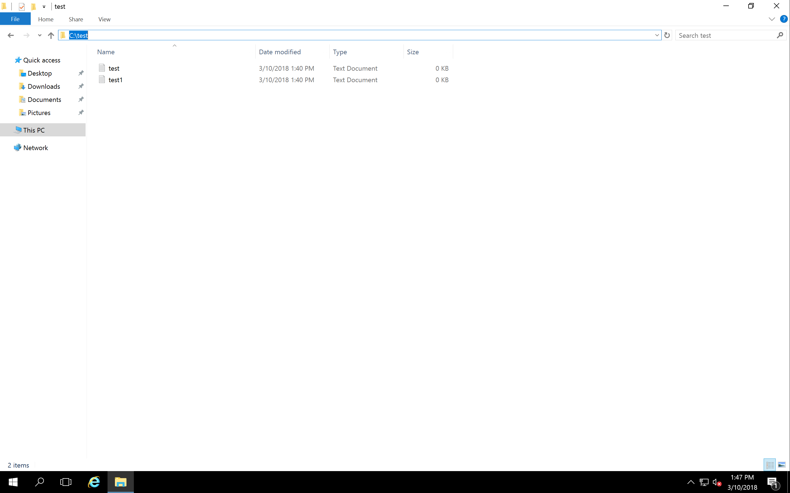
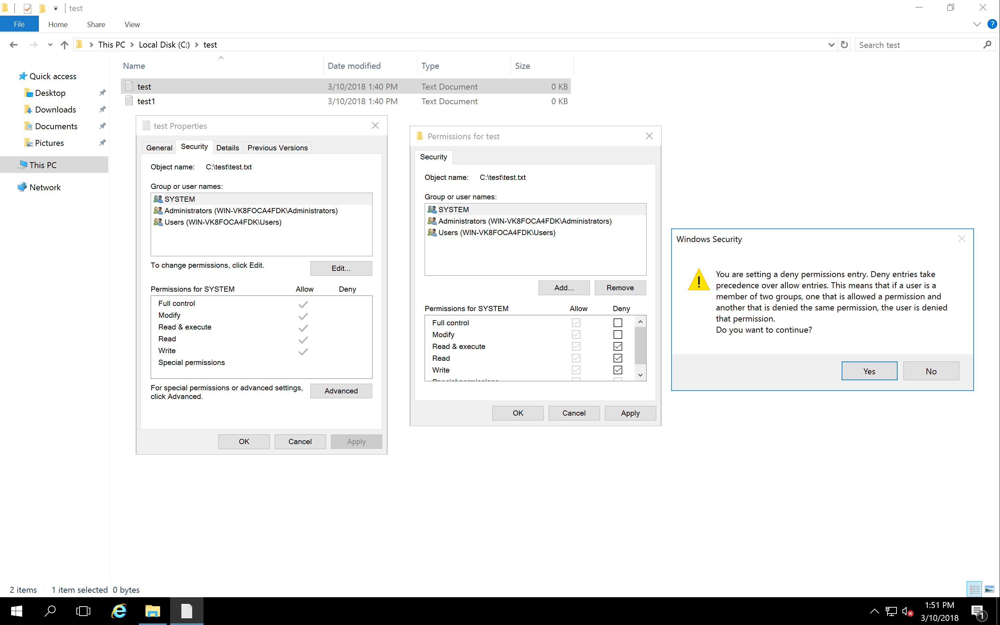
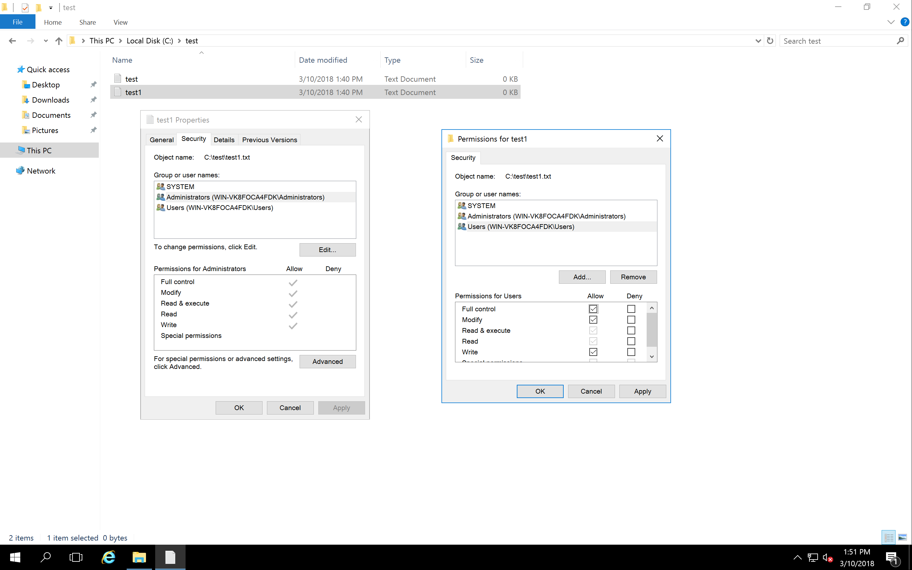
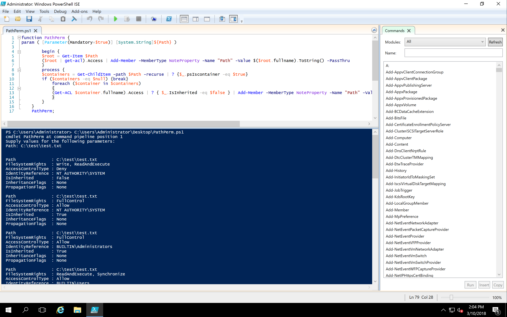

#### [Day 2: Auditing Permissions](https://cqureacademy.com/challenge/day-2-auditing-permissions)

###### Question

1. Which OS command allows you to work with file permissions in Windows 10?

	**`icacls.exe`**

2. Can one file have both deny and allow entry for the same user/group on the Access Control List?

	**`Yes, however it is not easy to make this from graphical interface.`**

3. What happens to a file when it has “Allow” and “Deny” for the same group on the ACL?

	**`It depends on the order of ACE in ACL`**

4. How can you set file permissions from PowerShell?

	**`Set-ACL`**

5. Does registry hives have permissions (ACLs)?

	**`Yes, but with rights different than files and folders`**
	
###### Exercise

- Prerequisite: Create test files: `c:\test\test.txt`​ and `c:\test\test1.txt`​. Share them with somebody in the network with random permissions.

1. In the Powershell​ console type the following: `get-acl c:\windows| get-member`

2. Try: `get-acl c:\windows\win.ini | get-member` - r​eview the output.

3. To clarify the view run: `get-acl c:\windows | format-list` ​- what you see as an output is a list with numbers and discussed previously `SDDL` string.

4. Try: `get-acl hklm:\software | format-list` - ​review the output.

5. Let’s enumerate file system rights, to know what are the options possible to assign: `[system.enum]::getnames([System.Security.AccessControl.FileSystemRights])`

6. To analyze the Write permission: `[int]([System.Security.AccessControl.FileSystemRights]::Write)` ​– do this for other
permissions too!

7. Run also: `[int]([System.Security.AccessControl.FileSystemRights]::Read​)` – note the number `131209`, ​where does it come from?

8. In the Powershell​ console type: `$myacl=get-acl c:\test\test.txt`

9. Check what is in the variable and format list: `$myacl | fl`

10. Verify what are the permissions for the test file: `get-acl C:\test\test.txt | fl`

11. Then set the permissions to the new file `set-acl c:\test\test1.txt $myacl` – you should be in the starting point

12. Try: `get-acl c:\test\test.txt | select -expand access`. ​What is the difference in comparison with the regular get-acl?

13. Enter the following in the console to get the owner of the folder: `get-acl c:\Windows | ft path, owner`

14. To start analyzing permissions on shares let’s use Windows Management Instrumentation in Powershell​: `Get-WMIObject Win32_Share`

15. In the console, turn on the filtering to list only shares that are not system shares: `Get-WMIObject Win32_share -filter "type=0"`

16. Let’s create a loop to list all permissions on the share:

	```
	foreach ($right in [System.Enum]::GetNames([System.Security.AccessControl.FileSystemRights])) {
	$intValue = [int]([System.Security.AccessControl.FileSystemRights]$right)
	Write-Host ("{0,-30} : {1}" -f $right, $intValue)
	}
	```

17. Close the Powershell​ window.

18. Open Windows Powershell ISE ​and click Open​ icon and use the `PathPerm.ps1​` script.

19. Review the script and run it (press F5​ or click on the green arrow​ to run the script).

20. Type the path: `C:\​` and press Enter​. Note listing of all permissions for folders and subfolders.

- Important:
There is NO one and only answer to the Part 2 of this challenge, that is why there is no “Submit”
process. BUT if you are eager to share your results and thinking process to the Challenge Part 2,
please share it on your favorite social channel, tag CQURE in your post and use #CQURE5DC

###### Solution







```PowerShell
PS C:\Users\Administrator> get-acl c:\windows| get-member


   TypeName: System.Security.AccessControl.DirectorySecurity

Name                            MemberType     Definition
----                            ----------     ----------
Access                          CodeProperty   System.Security.AccessControl.AuthorizationRuleCollection Access{get=...
CentralAccessPolicyId           CodeProperty   System.Security.Principal.SecurityIdentifier CentralAccessPolicyId{ge...
CentralAccessPolicyName         CodeProperty   System.String CentralAccessPolicyName{get=GetCentralAccessPolicyName;}
Group                           CodeProperty   System.String Group{get=GetGroup;}
Owner                           CodeProperty   System.String Owner{get=GetOwner;}
Path                            CodeProperty   System.String Path{get=GetPath;}
Sddl                            CodeProperty   System.String Sddl{get=GetSddl;}
AccessRuleFactory               Method         System.Security.AccessControl.AccessRule AccessRuleFactory(System.Sec...
AddAccessRule                   Method         void AddAccessRule(System.Security.AccessControl.FileSystemAccessRule...
AddAuditRule                    Method         void AddAuditRule(System.Security.AccessControl.FileSystemAuditRule r...
AuditRuleFactory                Method         System.Security.AccessControl.AuditRule AuditRuleFactory(System.Secur...
Equals                          Method         bool Equals(System.Object obj)
GetAccessRules                  Method         System.Security.AccessControl.AuthorizationRuleCollection GetAccessRu...
GetAuditRules                   Method         System.Security.AccessControl.AuthorizationRuleCollection GetAuditRul...
GetGroup                        Method         System.Security.Principal.IdentityReference GetGroup(type targetType)
GetHashCode                     Method         int GetHashCode()
GetOwner                        Method         System.Security.Principal.IdentityReference GetOwner(type targetType)
GetSecurityDescriptorBinaryForm Method         byte[] GetSecurityDescriptorBinaryForm()
GetSecurityDescriptorSddlForm   Method         string GetSecurityDescriptorSddlForm(System.Security.AccessControl.Ac...
GetType                         Method         type GetType()
ModifyAccessRule                Method         bool ModifyAccessRule(System.Security.AccessControl.AccessControlModi...
ModifyAuditRule                 Method         bool ModifyAuditRule(System.Security.AccessControl.AccessControlModif...
PurgeAccessRules                Method         void PurgeAccessRules(System.Security.Principal.IdentityReference ide...
PurgeAuditRules                 Method         void PurgeAuditRules(System.Security.Principal.IdentityReference iden...
RemoveAccessRule                Method         bool RemoveAccessRule(System.Security.AccessControl.FileSystemAccessR...
RemoveAccessRuleAll             Method         void RemoveAccessRuleAll(System.Security.AccessControl.FileSystemAcce...
RemoveAccessRuleSpecific        Method         void RemoveAccessRuleSpecific(System.Security.AccessControl.FileSyste...
RemoveAuditRule                 Method         bool RemoveAuditRule(System.Security.AccessControl.FileSystemAuditRul...
RemoveAuditRuleAll              Method         void RemoveAuditRuleAll(System.Security.AccessControl.FileSystemAudit...
RemoveAuditRuleSpecific         Method         void RemoveAuditRuleSpecific(System.Security.AccessControl.FileSystem...
ResetAccessRule                 Method         void ResetAccessRule(System.Security.AccessControl.FileSystemAccessRu...
SetAccessRule                   Method         void SetAccessRule(System.Security.AccessControl.FileSystemAccessRule...
SetAccessRuleProtection         Method         void SetAccessRuleProtection(bool isProtected, bool preserveInheritance)
SetAuditRule                    Method         void SetAuditRule(System.Security.AccessControl.FileSystemAuditRule r...
SetAuditRuleProtection          Method         void SetAuditRuleProtection(bool isProtected, bool preserveInheritance)
SetGroup                        Method         void SetGroup(System.Security.Principal.IdentityReference identity)
SetOwner                        Method         void SetOwner(System.Security.Principal.IdentityReference identity)
SetSecurityDescriptorBinaryForm Method         void SetSecurityDescriptorBinaryForm(byte[] binaryForm), void SetSecu...
SetSecurityDescriptorSddlForm   Method         void SetSecurityDescriptorSddlForm(string sddlForm), void SetSecurity...
ToString                        Method         string ToString()
PSChildName                     NoteProperty   string PSChildName=windows
PSDrive                         NoteProperty   PSDriveInfo PSDrive=C
PSParentPath                    NoteProperty   string PSParentPath=Microsoft.PowerShell.Core\FileSystem::C:\
PSPath                          NoteProperty   string PSPath=Microsoft.PowerShell.Core\FileSystem::C:\windows
PSProvider                      NoteProperty   ProviderInfo PSProvider=Microsoft.PowerShell.Core\FileSystem
AccessRightType                 Property       type AccessRightType {get;}
AccessRuleType                  Property       type AccessRuleType {get;}
AreAccessRulesCanonical         Property       bool AreAccessRulesCanonical {get;}
AreAccessRulesProtected         Property       bool AreAccessRulesProtected {get;}
AreAuditRulesCanonical          Property       bool AreAuditRulesCanonical {get;}
AreAuditRulesProtected          Property       bool AreAuditRulesProtected {get;}
AuditRuleType                   Property       type AuditRuleType {get;}
AccessToString                  ScriptProperty System.Object AccessToString {get=$toString = "";...
AuditToString                   ScriptProperty System.Object AuditToString {get=$toString = "";...


PS C:\Users\Administrator>
```

```PowerShell
PS C:\Users\Administrator> get-acl c:\windows\win.ini | get-member


   TypeName: System.Security.AccessControl.FileSecurity

Name                            MemberType     Definition
----                            ----------     ----------
Access                          CodeProperty   System.Security.AccessControl.AuthorizationRuleCollection Access{get=GetAccess;}
CentralAccessPolicyId           CodeProperty   System.Security.Principal.SecurityIdentifier CentralAccessPolicyId{get=GetCentralAccessPolicyId;}
CentralAccessPolicyName         CodeProperty   System.String CentralAccessPolicyName{get=GetCentralAccessPolicyName;}
Group                           CodeProperty   System.String Group{get=GetGroup;}
Owner                           CodeProperty   System.String Owner{get=GetOwner;}
Path                            CodeProperty   System.String Path{get=GetPath;}
Sddl                            CodeProperty   System.String Sddl{get=GetSddl;}
AccessRuleFactory               Method         System.Security.AccessControl.AccessRule AccessRuleFactory(System.Security.Principal.IdentityReference identityReference, int accessMask, bool isInherit...
AddAccessRule                   Method         void AddAccessRule(System.Security.AccessControl.FileSystemAccessRule rule)
AddAuditRule                    Method         void AddAuditRule(System.Security.AccessControl.FileSystemAuditRule rule)
AuditRuleFactory                Method         System.Security.AccessControl.AuditRule AuditRuleFactory(System.Security.Principal.IdentityReference identityReference, int accessMask, bool isInherited...
Equals                          Method         bool Equals(System.Object obj)
GetAccessRules                  Method         System.Security.AccessControl.AuthorizationRuleCollection GetAccessRules(bool includeExplicit, bool includeInherited, type targetType)
GetAuditRules                   Method         System.Security.AccessControl.AuthorizationRuleCollection GetAuditRules(bool includeExplicit, bool includeInherited, type targetType)
GetGroup                        Method         System.Security.Principal.IdentityReference GetGroup(type targetType)
GetHashCode                     Method         int GetHashCode()
GetOwner                        Method         System.Security.Principal.IdentityReference GetOwner(type targetType)
GetSecurityDescriptorBinaryForm Method         byte[] GetSecurityDescriptorBinaryForm()
GetSecurityDescriptorSddlForm   Method         string GetSecurityDescriptorSddlForm(System.Security.AccessControl.AccessControlSections includeSections)
GetType                         Method         type GetType()
ModifyAccessRule                Method         bool ModifyAccessRule(System.Security.AccessControl.AccessControlModification modification, System.Security.AccessControl.AccessRule rule, [ref] bool mo...
ModifyAuditRule                 Method         bool ModifyAuditRule(System.Security.AccessControl.AccessControlModification modification, System.Security.AccessControl.AuditRule rule, [ref] bool modi...
PurgeAccessRules                Method         void PurgeAccessRules(System.Security.Principal.IdentityReference identity)
PurgeAuditRules                 Method         void PurgeAuditRules(System.Security.Principal.IdentityReference identity)
RemoveAccessRule                Method         bool RemoveAccessRule(System.Security.AccessControl.FileSystemAccessRule rule)
RemoveAccessRuleAll             Method         void RemoveAccessRuleAll(System.Security.AccessControl.FileSystemAccessRule rule)
RemoveAccessRuleSpecific        Method         void RemoveAccessRuleSpecific(System.Security.AccessControl.FileSystemAccessRule rule)
RemoveAuditRule                 Method         bool RemoveAuditRule(System.Security.AccessControl.FileSystemAuditRule rule)
RemoveAuditRuleAll              Method         void RemoveAuditRuleAll(System.Security.AccessControl.FileSystemAuditRule rule)
RemoveAuditRuleSpecific         Method         void RemoveAuditRuleSpecific(System.Security.AccessControl.FileSystemAuditRule rule)
ResetAccessRule                 Method         void ResetAccessRule(System.Security.AccessControl.FileSystemAccessRule rule)
SetAccessRule                   Method         void SetAccessRule(System.Security.AccessControl.FileSystemAccessRule rule)
SetAccessRuleProtection         Method         void SetAccessRuleProtection(bool isProtected, bool preserveInheritance)
SetAuditRule                    Method         void SetAuditRule(System.Security.AccessControl.FileSystemAuditRule rule)
SetAuditRuleProtection          Method         void SetAuditRuleProtection(bool isProtected, bool preserveInheritance)
SetGroup                        Method         void SetGroup(System.Security.Principal.IdentityReference identity)
SetOwner                        Method         void SetOwner(System.Security.Principal.IdentityReference identity)
SetSecurityDescriptorBinaryForm Method         void SetSecurityDescriptorBinaryForm(byte[] binaryForm), void SetSecurityDescriptorBinaryForm(byte[] binaryForm, System.Security.AccessControl.AccessCon...
SetSecurityDescriptorSddlForm   Method         void SetSecurityDescriptorSddlForm(string sddlForm), void SetSecurityDescriptorSddlForm(string sddlForm, System.Security.AccessControl.AccessControlSect...
ToString                        Method         string ToString()
PSChildName                     NoteProperty   string PSChildName=win.ini
PSDrive                         NoteProperty   PSDriveInfo PSDrive=C
PSParentPath                    NoteProperty   string PSParentPath=Microsoft.PowerShell.Core\FileSystem::C:\windows
PSPath                          NoteProperty   string PSPath=Microsoft.PowerShell.Core\FileSystem::C:\windows\win.ini
PSProvider                      NoteProperty   ProviderInfo PSProvider=Microsoft.PowerShell.Core\FileSystem
AccessRightType                 Property       type AccessRightType {get;}
AccessRuleType                  Property       type AccessRuleType {get;}
AreAccessRulesCanonical         Property       bool AreAccessRulesCanonical {get;}
AreAccessRulesProtected         Property       bool AreAccessRulesProtected {get;}
AreAuditRulesCanonical          Property       bool AreAuditRulesCanonical {get;}
AreAuditRulesProtected          Property       bool AreAuditRulesProtected {get;}
AuditRuleType                   Property       type AuditRuleType {get;}
AccessToString                  ScriptProperty System.Object AccessToString {get=$toString = "";...
AuditToString                   ScriptProperty System.Object AuditToString {get=$toString = "";...


PS C:\Users\Administrator>
```

```PowerShell
PS C:\Users\Administrator> get-acl c:\windows | format-list


Path   : Microsoft.PowerShell.Core\FileSystem::C:\windows
Owner  : NT SERVICE\TrustedInstaller
Group  : NT SERVICE\TrustedInstaller
Access : CREATOR OWNER Allow  268435456
         NT AUTHORITY\SYSTEM Allow  268435456
         NT AUTHORITY\SYSTEM Allow  Modify, Synchronize
         BUILTIN\Administrators Allow  268435456
         BUILTIN\Administrators Allow  Modify, Synchronize
         BUILTIN\Users Allow  -1610612736
         BUILTIN\Users Allow  ReadAndExecute, Synchronize
         NT SERVICE\TrustedInstaller Allow  268435456
         NT SERVICE\TrustedInstaller Allow  FullControl
         APPLICATION PACKAGE AUTHORITY\ALL APPLICATION PACKAGES Allow  ReadAndExecute, Synchronize
         APPLICATION PACKAGE AUTHORITY\ALL APPLICATION PACKAGES Allow  -1610612736
         APPLICATION PACKAGE AUTHORITY\ALL RESTRICTED APPLICATION PACKAGES Allow  ReadAndExecute, Synchronize
         APPLICATION PACKAGE AUTHORITY\ALL RESTRICTED APPLICATION PACKAGES Allow  -1610612736
Audit  :
Sddl   : O:S-1-5-80-956008885-3418522649-1831038044-1853292631-2271478464G:S-1-5-80-956008885-3418522649-1831038044-1853292631-2271478464D:PAI(A;OICIIO;GA;;;CO)(A;OICIIO;GA;;;SY)(A;;0x1301bf;;;SY)(A;OIC
         IIO;GA;;;BA)(A;;0x1301bf;;;BA)(A;OICIIO;GXGR;;;BU)(A;;0x1200a9;;;BU)(A;CIIO;GA;;;S-1-5-80-956008885-3418522649-1831038044-1853292631-2271478464)(A;;FA;;;S-1-5-80-956008885-3418522649-1831038044
         -1853292631-2271478464)(A;;0x1200a9;;;AC)(A;OICIIO;GXGR;;;AC)(A;;0x1200a9;;;S-1-15-2-2)(A;OICIIO;GXGR;;;S-1-15-2-2)


PS C:\Users\Administrator>
```

```PowerShell
PS C:\Users\Administrator> get-acl hklm:\software | format-list


Path   : Microsoft.PowerShell.Core\Registry::HKEY_LOCAL_MACHINE\software
Owner  : BUILTIN\Administrators
Group  : NT AUTHORITY\SYSTEM
Access : CREATOR OWNER Allow  FullControl
         NT AUTHORITY\SYSTEM Allow  FullControl
         BUILTIN\Administrators Allow  FullControl
         BUILTIN\Users Allow  ReadKey
         APPLICATION PACKAGE AUTHORITY\ALL APPLICATION PACKAGES Allow  ReadKey
Audit  :
Sddl   : O:BAG:SYD:PAI(A;CI;KA;;;CO)(A;CI;KA;;;SY)(A;CI;KA;;;BA)(A;CI;KR;;;BU)(A;CI;KR;;;AC)


PS C:\Users\Administrator>
```

```PowerShell
PS C:\Users\Administrator> [system.enum]::getnames([System.Security.AccessControl.FileSystemRights])
ListDirectory
ReadData
WriteData
CreateFiles
CreateDirectories
AppendData
ReadExtendedAttributes
WriteExtendedAttributes
Traverse
ExecuteFile
DeleteSubdirectoriesAndFiles
ReadAttributes
WriteAttributes
Write
Delete
ReadPermissions
Read
ReadAndExecute
Modify
ChangePermissions
TakeOwnership
Synchronize
FullControl
PS C:\Users\Administrator>
```

```PowerShell
PS C:\Users\Administrator> [int]([System.Security.AccessControl.FileSystemRights]::Write)
278
PS C:\Users\Administrator>
```

```PowerShell
PS C:\Users\Administrator> [int]([System.Security.AccessControl.FileSystemRights]::Read)
131209
PS C:\Users\Administrator>
```

```PowerShell
PS C:\Users\Administrator> $myacl=get-acl c:\test\test.txt
PS C:\Users\Administrator>
```

```PowerShell
PS C:\Users\Administrator> $myacl | fl


Path   : Microsoft.PowerShell.Core\FileSystem::C:\test\test.txt
Owner  : BUILTIN\Administrators
Group  : WIN-VK8FOCA4FDK\None
Access : NT AUTHORITY\SYSTEM Deny  Write, ReadAndExecute
         NT AUTHORITY\SYSTEM Allow  FullControl
         BUILTIN\Administrators Allow  FullControl
         BUILTIN\Users Allow  ReadAndExecute, Synchronize
Audit  :
Sddl   : O:BAG:S-1-5-21-2440985262-3249015187-168649629-513D:AI(D;;CCDCLCSWRPWPLOCRRC;;;SY)(A;ID;FA;;;SY)(A;ID;FA;;;BA)(A;ID;0x1200a9;;;BU)


PS C:\Users\Administrator>
```

```PowerShell
PS C:\Users\Administrator> get-acl C:\test\test.txt | fl


Path   : Microsoft.PowerShell.Core\FileSystem::C:\test\test.txt
Owner  : BUILTIN\Administrators
Group  : WIN-VK8FOCA4FDK\None
Access : NT AUTHORITY\SYSTEM Deny  Write, ReadAndExecute
         NT AUTHORITY\SYSTEM Allow  FullControl
         BUILTIN\Administrators Allow  FullControl
         BUILTIN\Users Allow  ReadAndExecute, Synchronize
Audit  :
Sddl   : O:BAG:S-1-5-21-2440985262-3249015187-168649629-513D:AI(D;;CCDCLCSWRPWPLOCRRC;;;SY)(A;ID;FA;;;SY)(A;ID;FA;;;BA)(A;ID;0x1200a9;;;BU)


PS C:\Users\Administrator>
```

```PowerShell
PS C:\Users\Administrator> set-acl c:\test\test1.txt $myacl
PS C:\Users\Administrator>
```

```PowerShell
PS C:\Users\Administrator> get-acl c:\test\test.txt | select -expand access


FileSystemRights  : Write, ReadAndExecute
AccessControlType : Deny
IdentityReference : NT AUTHORITY\SYSTEM
IsInherited       : False
InheritanceFlags  : None
PropagationFlags  : None

FileSystemRights  : FullControl
AccessControlType : Allow
IdentityReference : NT AUTHORITY\SYSTEM
IsInherited       : True
InheritanceFlags  : None
PropagationFlags  : None

FileSystemRights  : FullControl
AccessControlType : Allow
IdentityReference : BUILTIN\Administrators
IsInherited       : True
InheritanceFlags  : None
PropagationFlags  : None

FileSystemRights  : ReadAndExecute, Synchronize
AccessControlType : Allow
IdentityReference : BUILTIN\Users
IsInherited       : True
InheritanceFlags  : None
PropagationFlags  : None


PS C:\Users\Administrator>
```

```PowerShell
PS C:\Users\Administrator> get-acl c:\Windows | ft path, owner

Path                                             Owner
----                                             -----
Microsoft.PowerShell.Core\FileSystem::C:\Windows NT SERVICE\TrustedInstaller


PS C:\Users\Administrator>
```

```PowerShell
PS C:\Users\Administrator> Get-WMIObject Win32_Share

Name   Path       Description
----   ----       -----------
ADMIN$ C:\Windows Remote Admin
C$     C:\        Default share
IPC$              Remote IPC


PS C:\Users\Administrator>
```

```PowerShell
PS C:\Users\Administrator> Get-WMIObject Win32_share -filter "type=0"
PS C:\Users\Administrator>
```

```PowerShell
PS C:\Users\Administrator> foreach ($right in [System.Enum]::GetNames([System.Security.AccessControl.FileSystemRights])) {
>>     $intValue = [int]([System.Security.AccessControl.FileSystemRights]$right)
>>     Write-Host ("{0,-30} : {1}" -f $right, $intValue)
>> }
ListDirectory                  : 1
ReadData                       : 1
WriteData                      : 2
CreateFiles                    : 2
CreateDirectories              : 4
AppendData                     : 4
ReadExtendedAttributes         : 8
WriteExtendedAttributes        : 16
Traverse                       : 32
ExecuteFile                    : 32
DeleteSubdirectoriesAndFiles   : 64
ReadAttributes                 : 128
WriteAttributes                : 256
Write                          : 278
Delete                         : 65536
ReadPermissions                : 131072
Read                           : 131209
ReadAndExecute                 : 131241
Modify                         : 197055
ChangePermissions              : 262144
TakeOwnership                  : 524288
Synchronize                    : 1048576
FullControl                    : 2032127
PS C:\Users\Administrator>
```



```PowerShell
PS C:\Users\Administrator> C:\Users\Administrator\Desktop\PathPerm.ps1
cmdlet PathPerm at command pipeline position 1
Supply values for the following parameters:
Path: C:\test\test.txt


Path              : C:\test\test.txt
FileSystemRights  : Write, ReadAndExecute
AccessControlType : Deny
IdentityReference : NT AUTHORITY\SYSTEM
IsInherited       : False
InheritanceFlags  : None
PropagationFlags  : None

Path              : C:\test\test.txt
FileSystemRights  : FullControl
AccessControlType : Allow
IdentityReference : NT AUTHORITY\SYSTEM
IsInherited       : True
InheritanceFlags  : None
PropagationFlags  : None

Path              : C:\test\test.txt
FileSystemRights  : FullControl
AccessControlType : Allow
IdentityReference : BUILTIN\Administrators
IsInherited       : True
InheritanceFlags  : None
PropagationFlags  : None

Path              : C:\test\test.txt
FileSystemRights  : ReadAndExecute, Synchronize
AccessControlType : Allow
IdentityReference : BUILTIN\Users
IsInherited       : True
InheritanceFlags  : None
PropagationFlags  : None


PS C:\Users\Administrator> C:\Users\Administrator\Desktop\PathPerm.ps1
cmdlet PathPerm at command pipeline position 1
Supply values for the following parameters:
Path: C:\test\test1.txt


Path              : C:\test\test1.txt
FileSystemRights  : Write, ReadAndExecute
AccessControlType : Deny
IdentityReference : NT AUTHORITY\SYSTEM
IsInherited       : False
InheritanceFlags  : None
PropagationFlags  : None

Path              : C:\test\test1.txt
FileSystemRights  : FullControl
AccessControlType : Allow
IdentityReference : NT AUTHORITY\SYSTEM
IsInherited       : True
InheritanceFlags  : None
PropagationFlags  : None

Path              : C:\test\test1.txt
FileSystemRights  : FullControl
AccessControlType : Allow
IdentityReference : BUILTIN\Administrators
IsInherited       : True
InheritanceFlags  : None
PropagationFlags  : None

Path              : C:\test\test1.txt
FileSystemRights  : ReadAndExecute, Synchronize
AccessControlType : Allow
IdentityReference : BUILTIN\Users
IsInherited       : True
InheritanceFlags  : None
PropagationFlags  : None


PS C:\Users\Administrator> 
```