#### [Day 3. Windows Handles](https://cqureacademy.com/challenge/day-3-windows-handles)

- [CreateFile function](https://msdn.microsoft.com/en-us/library/windows/desktop/aa363858(v=vs.85).aspx)
- [ReadFile function](https://msdn.microsoft.com/en-us/library/windows/desktop/aa365467(v=vs.85).aspx)
- [CloseHandle function](https://msdn.microsoft.com/en-us/library/windows/desktop/ms724211(v=vs.85).aspx)

###### Question

1. What happens if one process opens a file for writing and later, another wants to read the same file?

	**``It all depends on the process which asked for a handle for writing.``**

2. What happens when you terminate the process owning a handle?

	**``The handle is closed.``**

3. Does the `handle.exe` utility from sysinternals allow to list handles owned by particular process?

	**``Yes, with -p parameter.``**

4. Which GUI tool may be used for finding handles?

	**``Procexp.exe``**

5. What can happen if you close the handle owned by another process?

	**``Data corruption or system crash``**

###### Exercise

- Unlocking the file

1. Download the `CQLocker.zip` file (please find the link below the video) and extract the content with `CQUREAcademy#123!` as a password.
2. Copy the `CQLocker.exe` file to the desktop of your test machine. You can also try on your workstation if you trust us. The file does not do any harm to your OS and/or data.
3. Double click `CQLocker.exe` on your desktop.
4. Observe the freshly created `CQLocker.txt` file. Can you access it? Feel free to try and experiment.
5. If you cannot delete the file it will be unlocked after OS restart. But it spoils the fun... ;)

- Important:

There is NO one and only answer to the Part 2 of this challenge, that is why there is no “Submit” process. BUT if you are eager to share your results and thinking process to the Challenge Part 2, please share it on your favorite social channel, tag CQURE in your post and use #CQURE5DC

###### Solution

- Using `Process Explorer`

	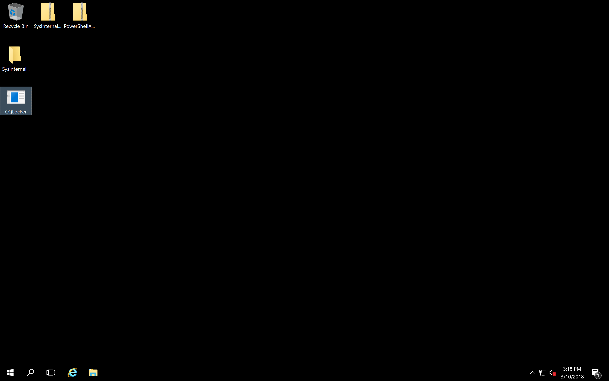
	
	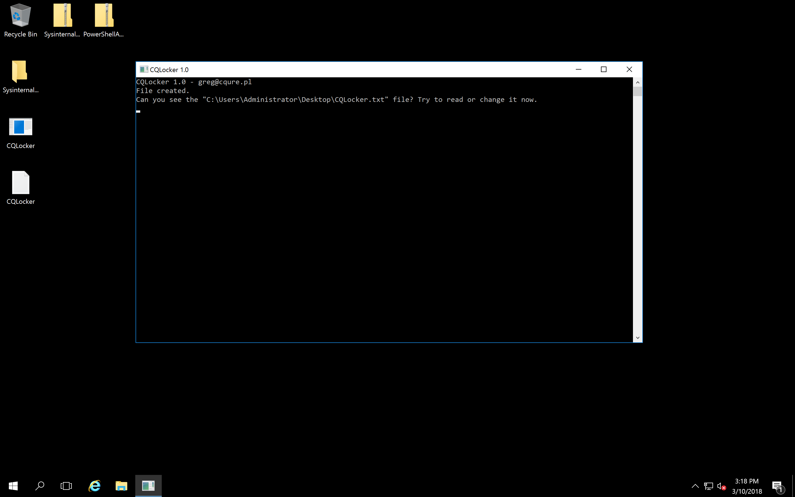
	
	
	
	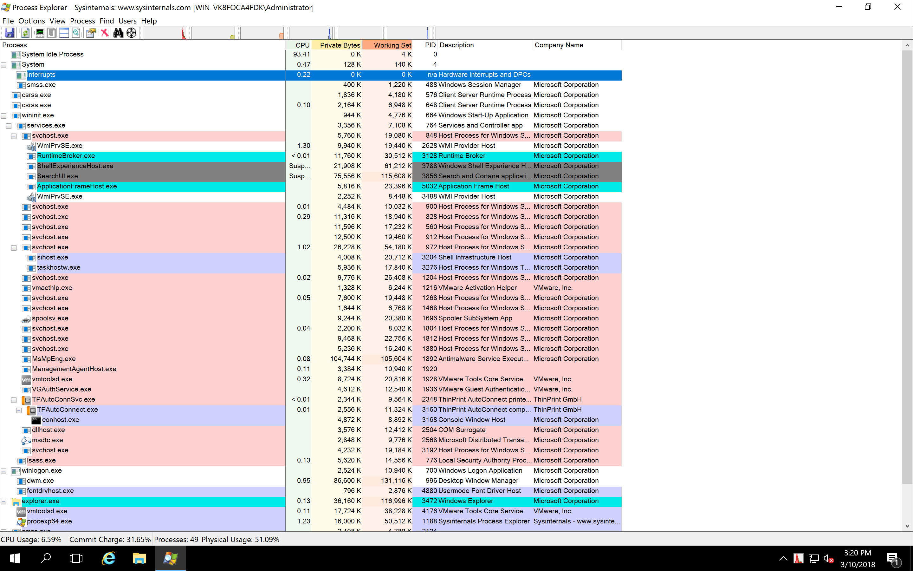
	
	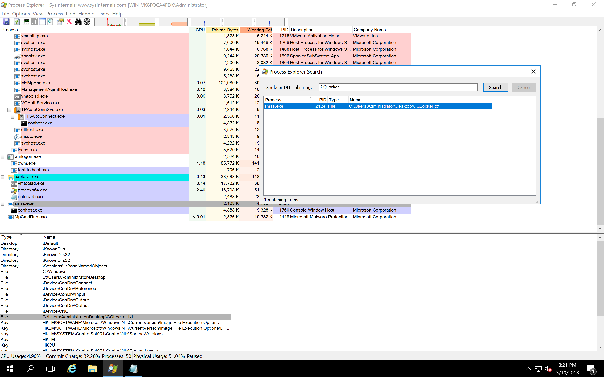
	
	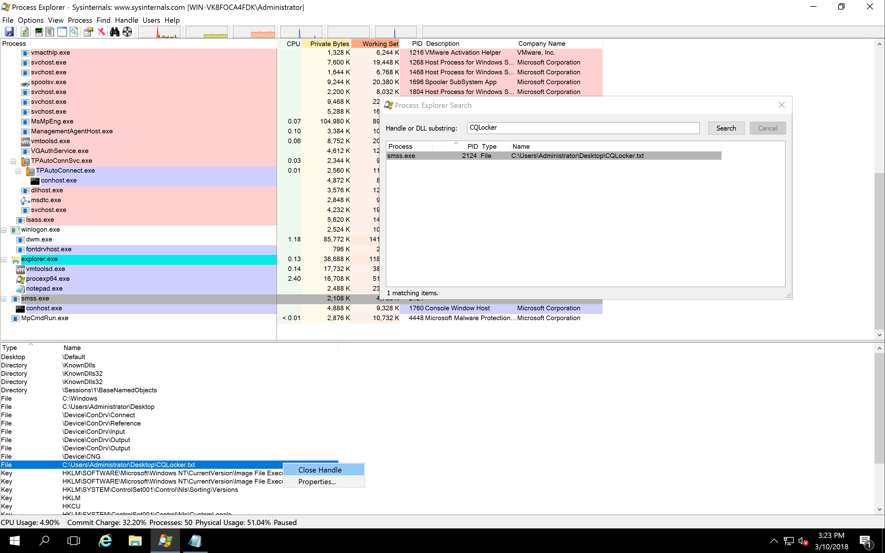
	
	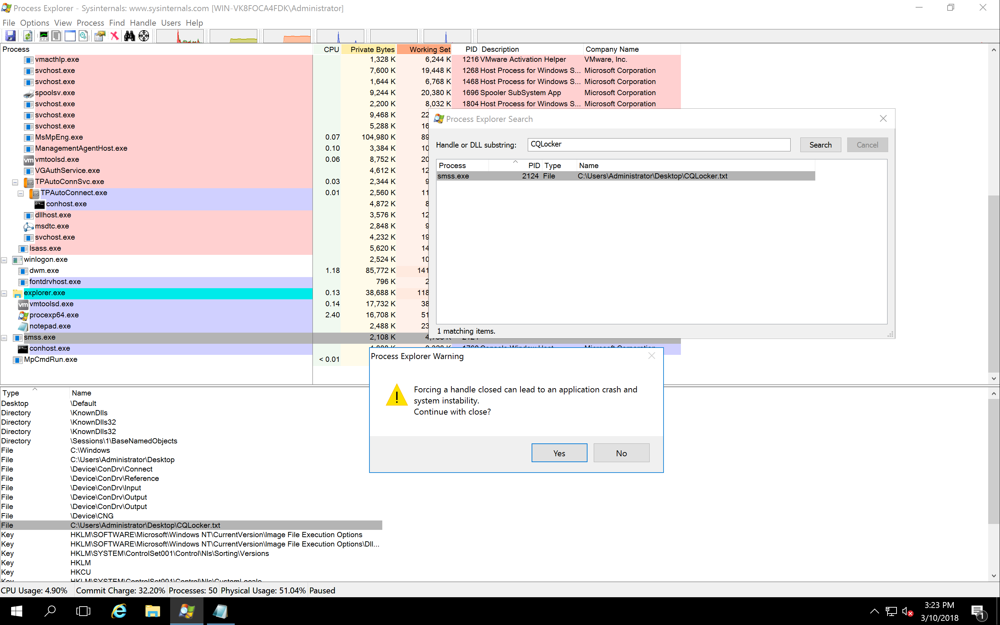
	
	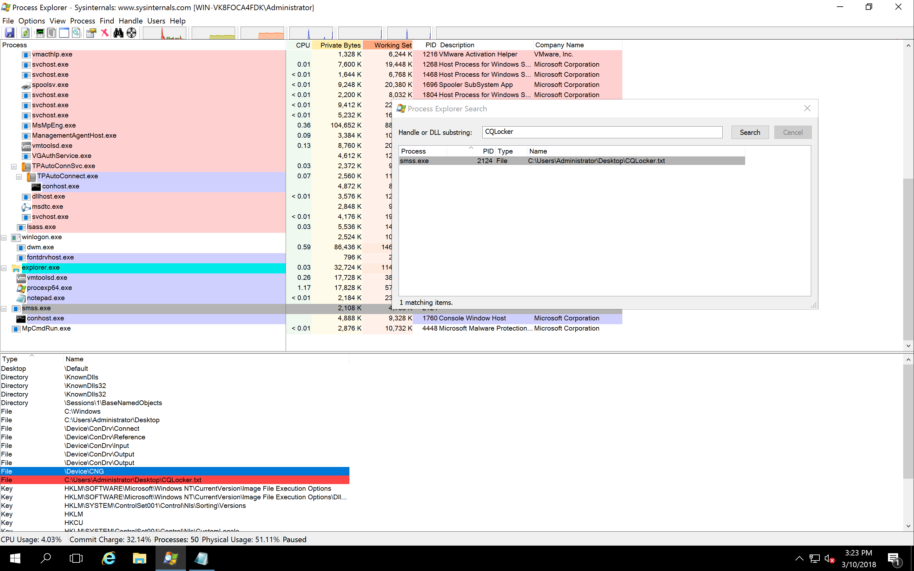
	
	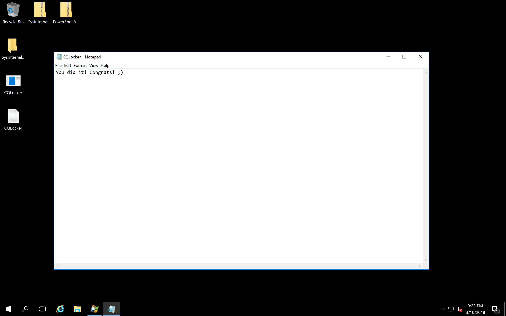
	
- Using `handle64.exe`

	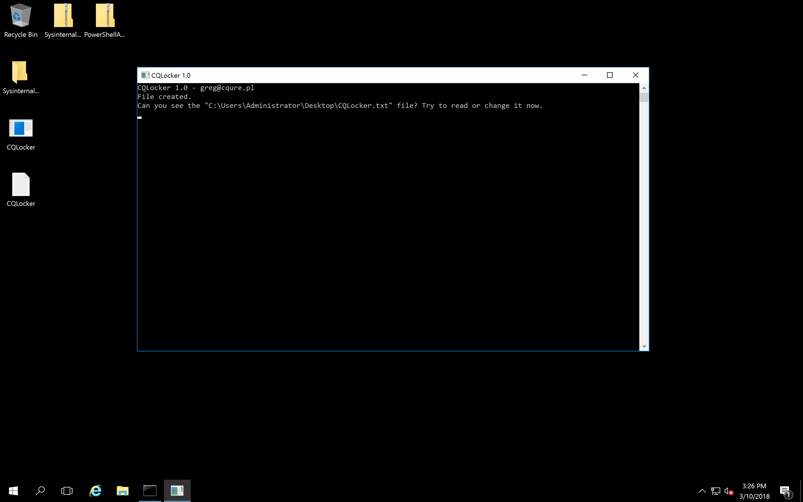
	
	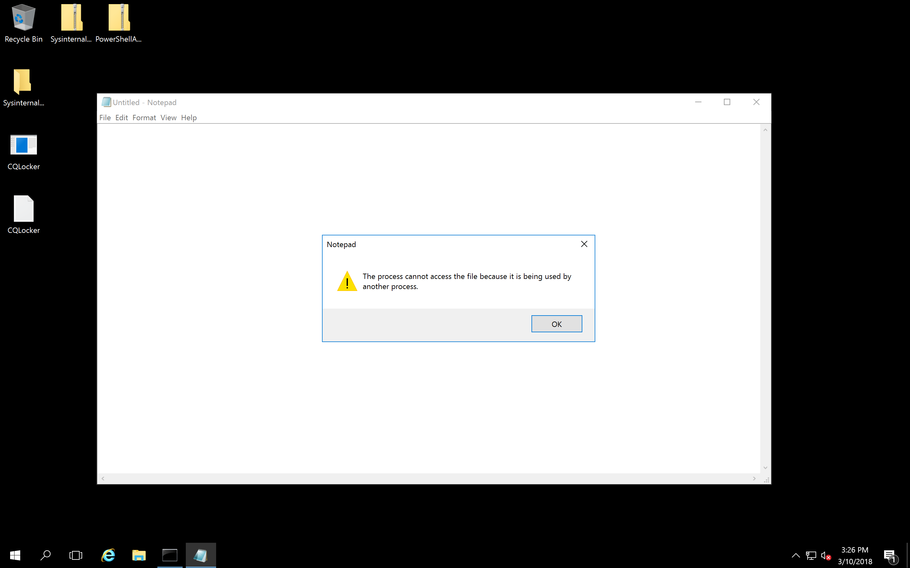
	
	```
	C:\Users\Administrator\Desktop\SysinternalsSuite>handle64.exe -h
	
	Nthandle v4.11 - Handle viewer
	Copyright (C) 1997-2017 Mark Russinovich
	Sysinternals - www.sysinternals.com
	
	usage: handle [[-a [-l]] [-u] | [-c <handle> [-y]] | [-s]] [-p <process>|<pid>] [name] [-nobanner]
	  -a         Dump all handle information.
	  -l         Just show pagefile-backed section handles.
	  -c         Closes the specified handle (interpreted as a hexadecimal number).
	             You must specify the process by its PID.
	             WARNING: Closing handles can cause application or system instability.
	  -y         Don't prompt for close handle confirmation.
	  -s         Print count of each type of handle open.
	  -u         Show the owning user name when searching for handles.
	  -p         Dump handles belonging to process (partial name accepted).
	  name       Search for handles to objects with <name> (fragment accepted).
	  -nobanner  Do not display the startup banner and copyright message.
	
	No arguments will dump all file references.
	
	C:\Users\Administrator\Desktop\SysinternalsSuite>handle64.exe -a CQLocker
	
	Nthandle v4.11 - Handle viewer
	Copyright (C) 1997-2017 Mark Russinovich
	Sysinternals - www.sysinternals.com
	
	smss.exe           pid: 2616   type: File           12C: C:\Users\Administrator\Desktop\CQLocker.txt
	
	C:\Users\Administrator\Desktop\SysinternalsSuite>handle64.exe -p 2616 -c 12C -y
	
	Nthandle v4.11 - Handle viewer
	Copyright (C) 1997-2017 Mark Russinovich
	Sysinternals - www.sysinternals.com
	
	  12C: File  (---)   C:\Users\Administrator\Desktop\CQLocker.txt
	
	Handle closed.
	
	C:\Users\Administrator\Desktop\SysinternalsSuite>
	```
	
	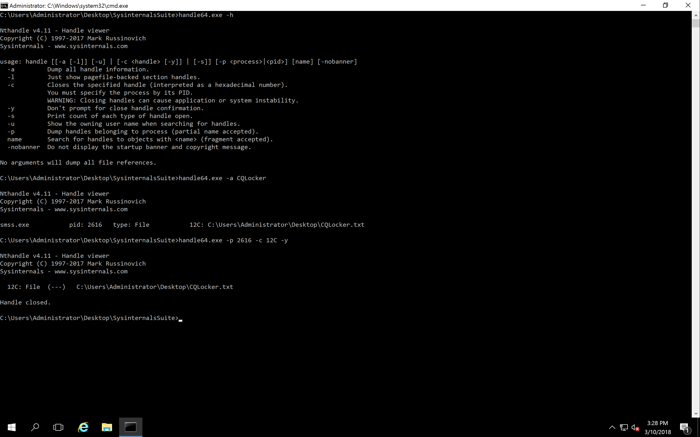
	
	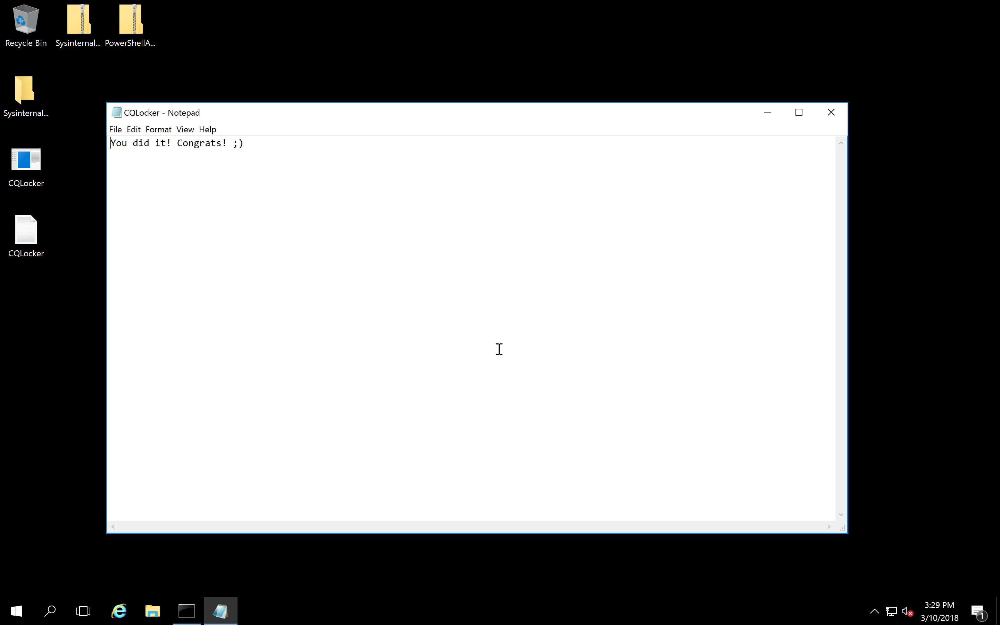
