#### [Day 5. Memory Dump](https://cqureacademy.com/challenge/day-5-memory-dump)

###### Questions

1. Which process in the OS can contain data about active users’ passwords?

	**`Lsass.exe`**

2. How can you create a process dump with tools built-in into Windows OS?

	**`With Task Manager`**

3. Which utility allows you to discover passwords from lsass.exe memory?

	**`Mimikatz`**

4. Which file DOES NOT contain sensitive information about passwords?

	**`Taskmgr.exe dump`**

5. Is it possible to create lsass.exe dump on the remote machine?

	**``Yes, with some form of remote access tools like psexec etc.*``**
	
###### Solution
	
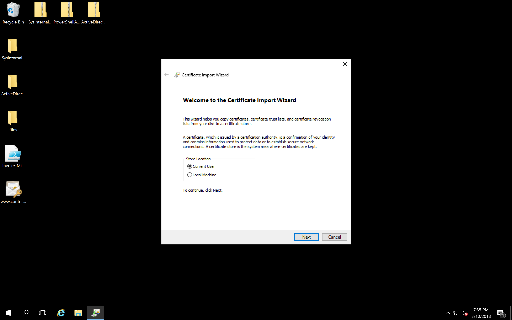

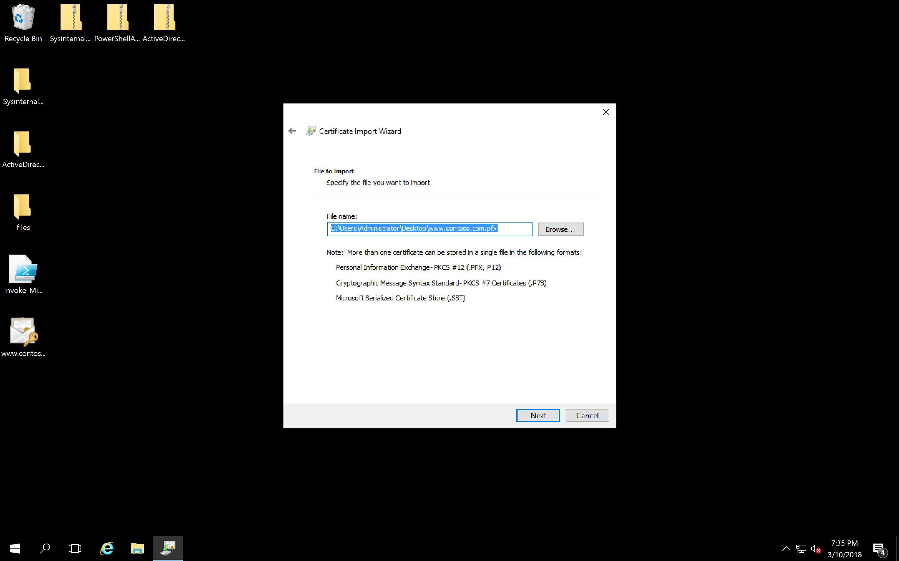

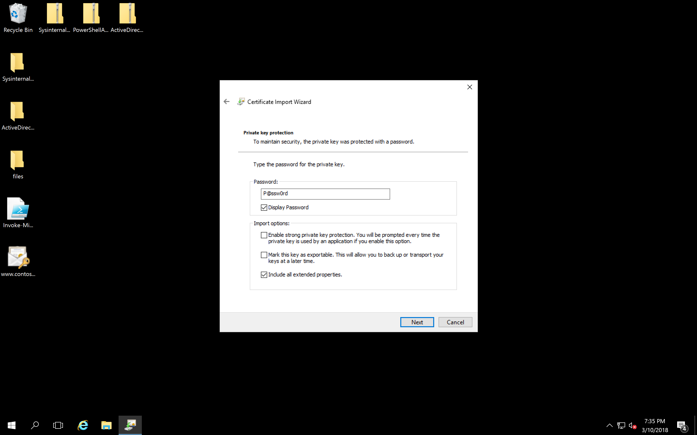

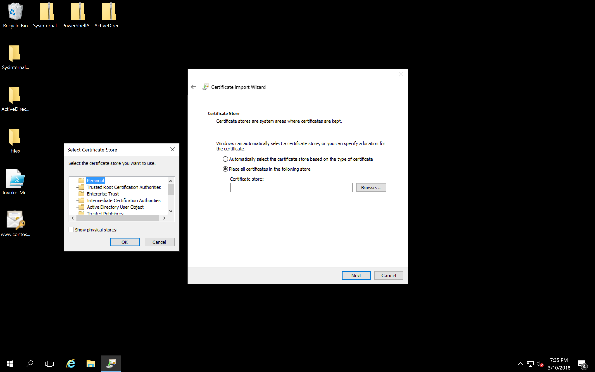

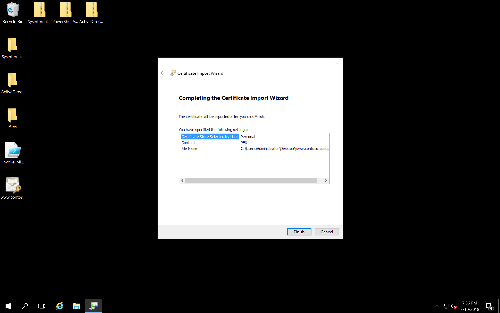

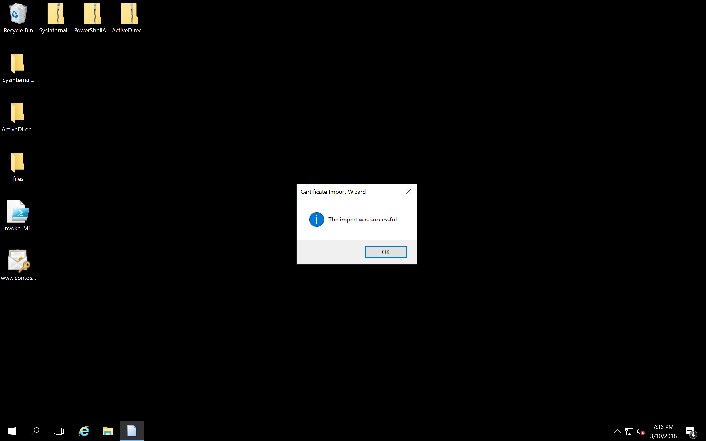

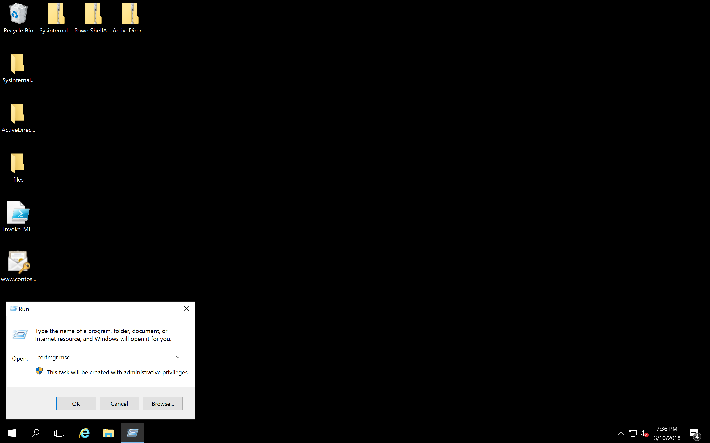

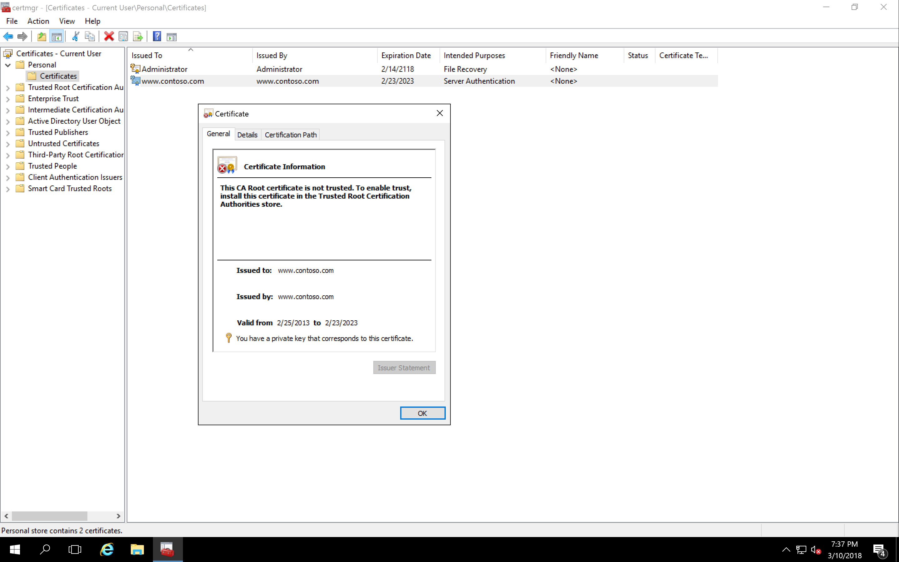

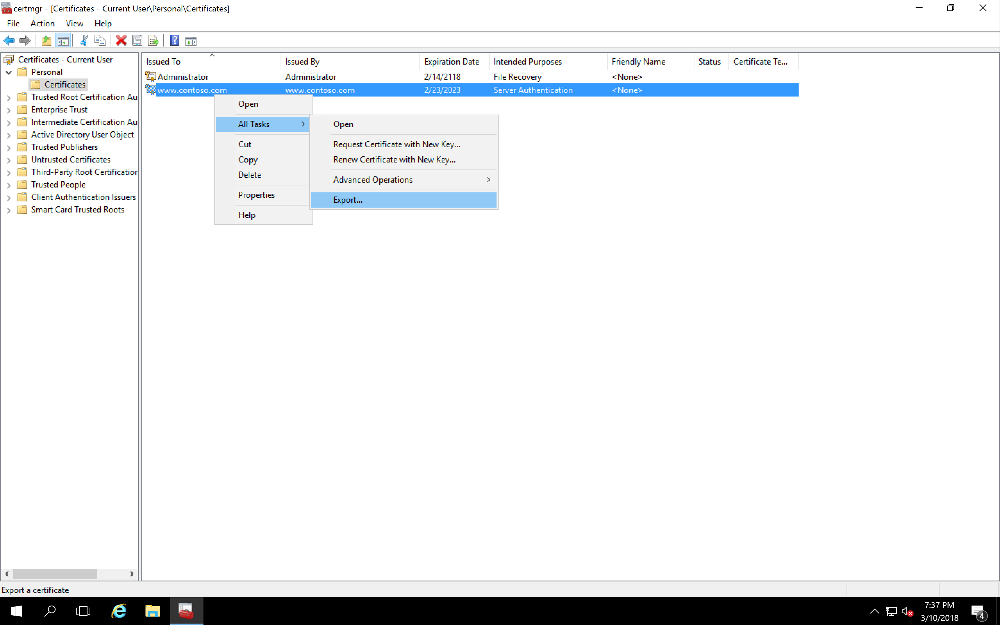

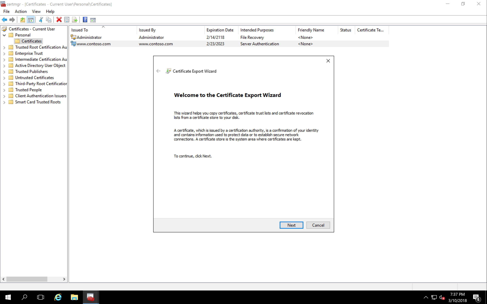

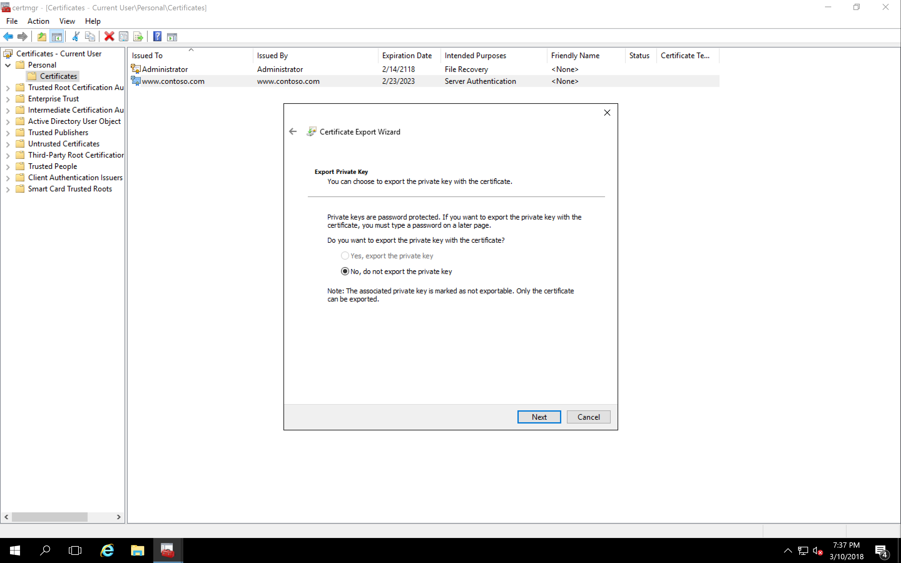

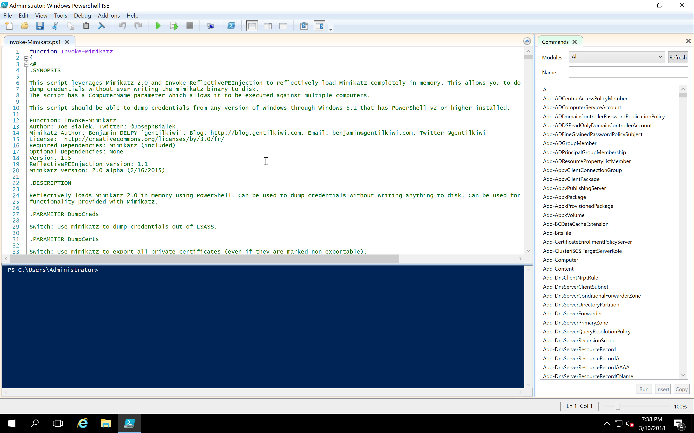

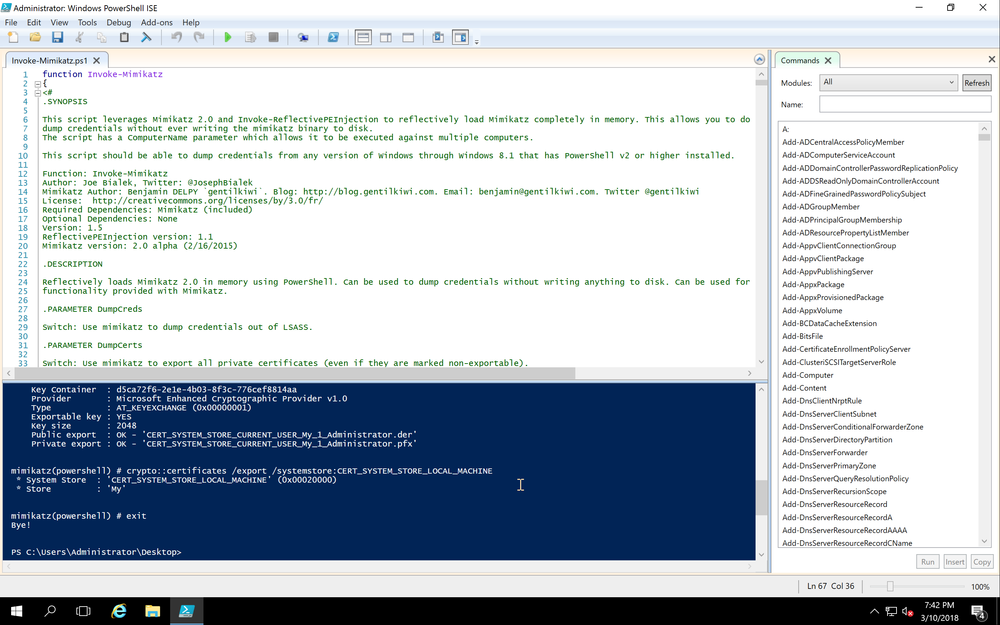

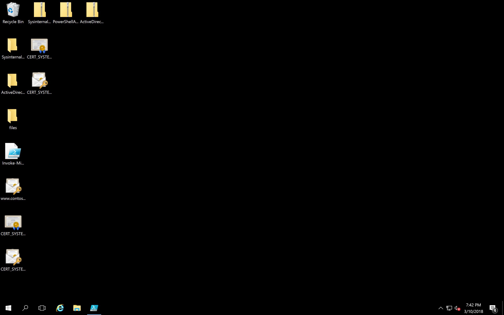

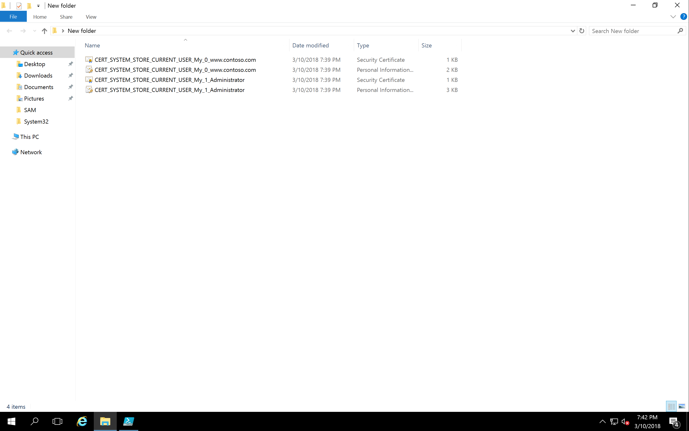