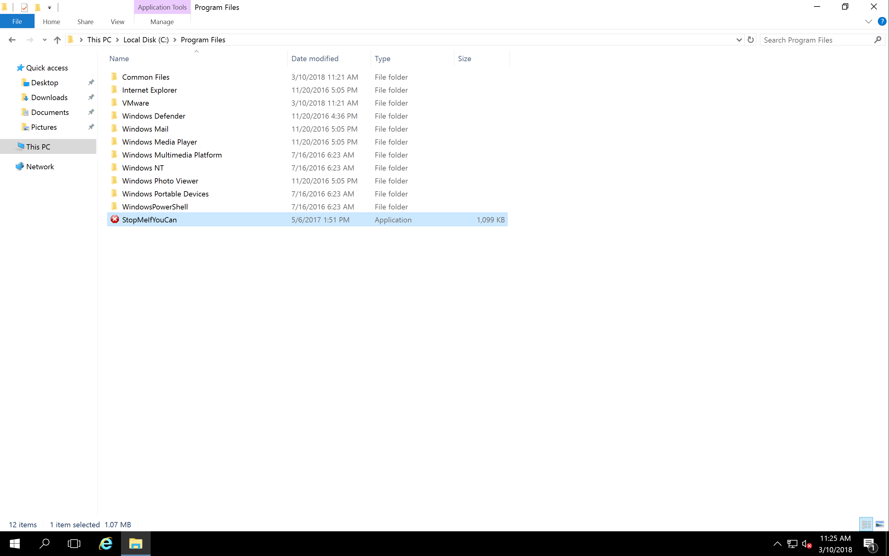
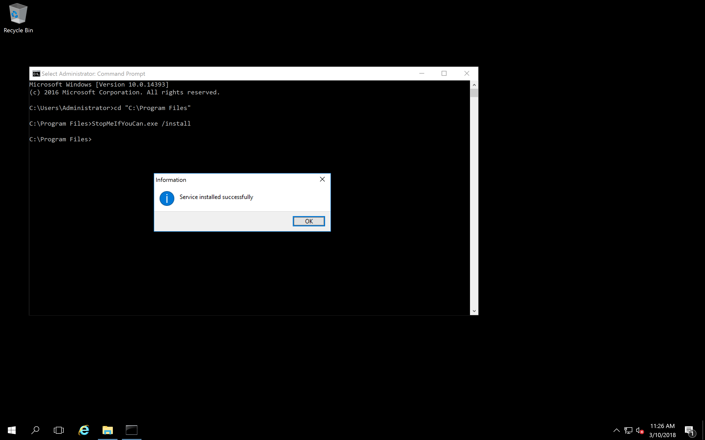
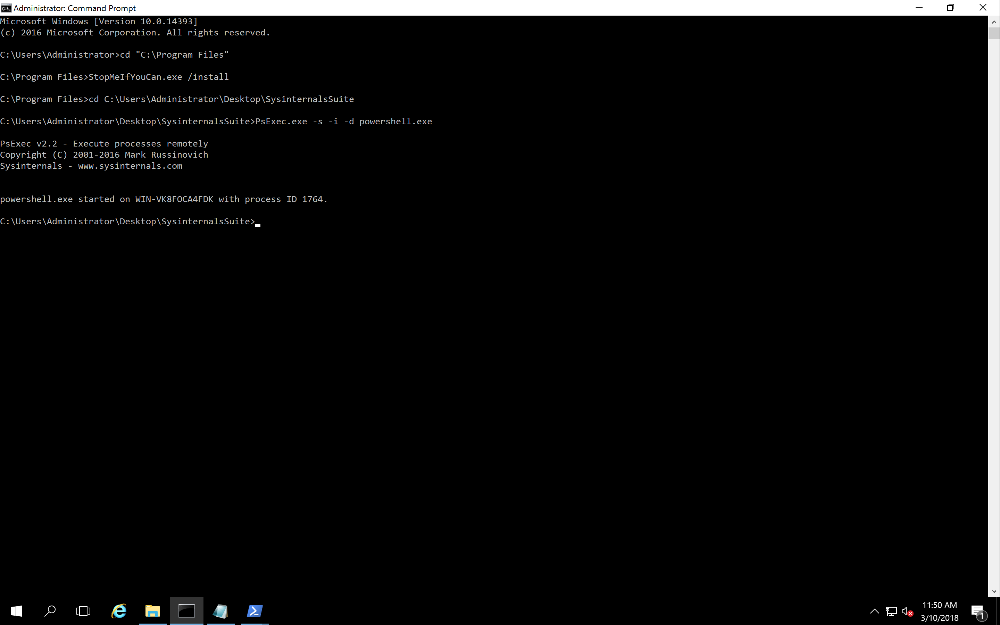
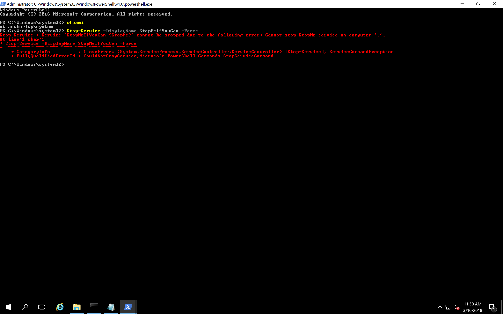
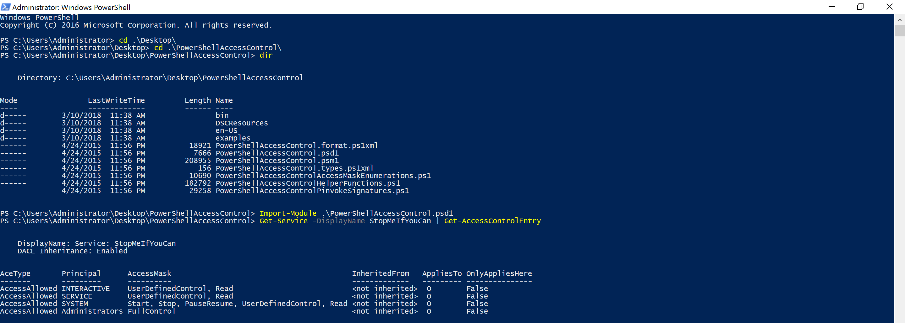
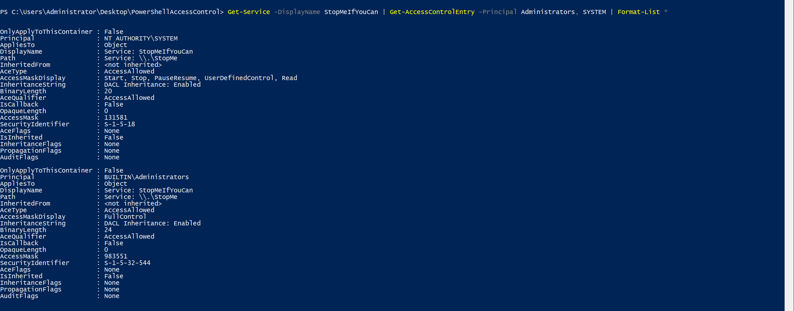
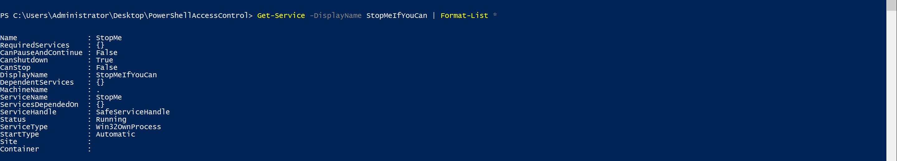
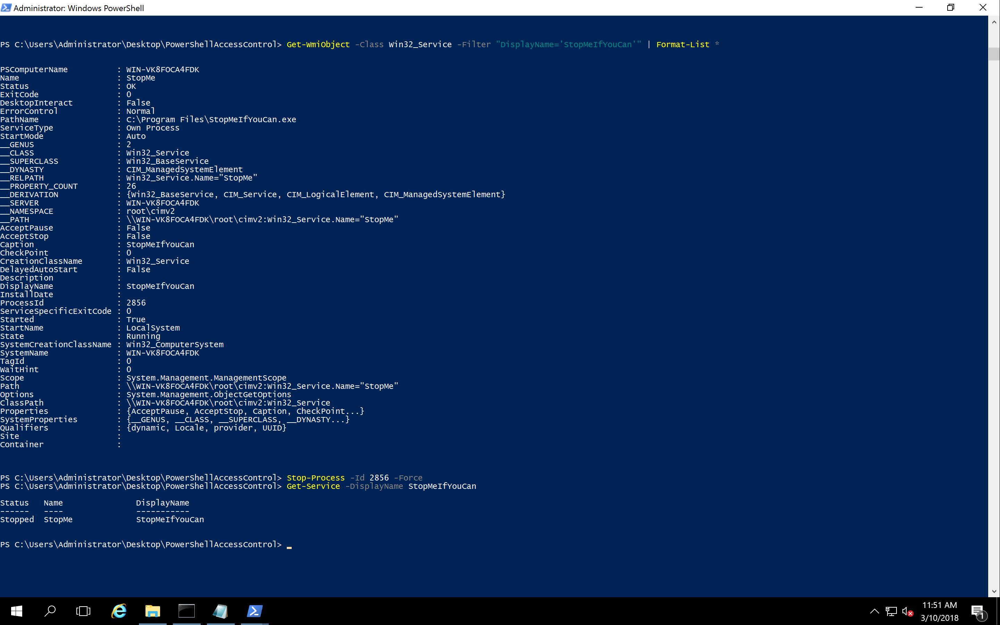
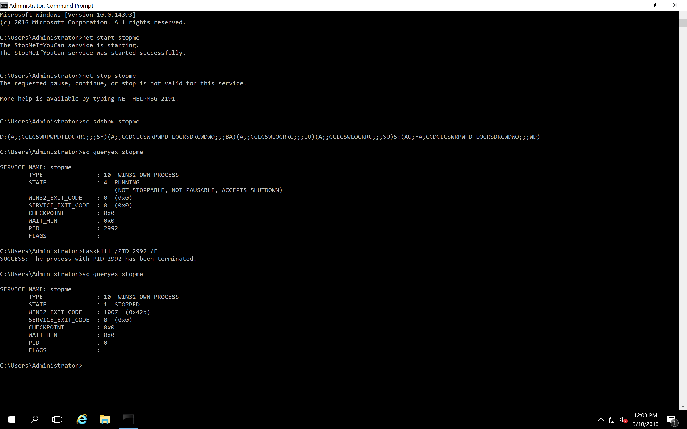
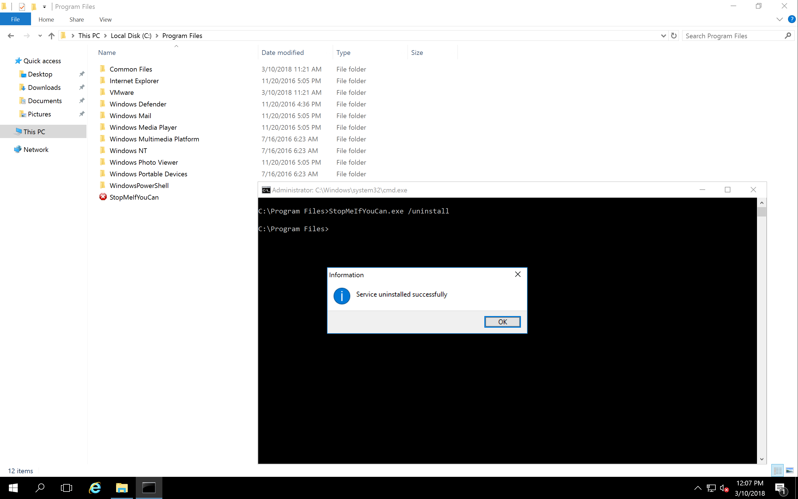

#### 1. [Day 1: Changing Service Rights](https://cqureacademy.com/challenge/day-1-changing-service-rights)

###### Questions

1. Which OS command may be used to change permissions for a service?

	**`sc.exe`**

2. How can we specify service permissions to be used with `sc.exe sdset` command?

	**`With SDDL`**

3. How can you specify an AD group to include it in SDDL?

	**`With SID`**

4. How localsystem account is represented in SDDL?

	**`SY`**

5. Which account should you use if you are local administrator on your workstation and you have no permissions to change service parameters?

	**`Localsystem`**

###### Exercise

- Stopping the unstoppable

1. Download the `StopMeIfYouCan.zip` file (please find the link below the video lesson) and extract the content with `CQUREAcademy#123!` as a password.
2. Logon to your test machine. You can also try on your workstation if you trust us. The file does not do any harm to your OS and/or data.
3. Launch the `cmd.exe` as administrator.
4. Copy the `StopMeIfYouCan.exe` file to the location for your binaries. It should be `C:\Program Files`, but you can use other locations (such as your desktop) as well even it is not the best practice.
5. Change the location within cmd.exe and install the service by typing `stopmeifyoucan.exe /install`. Observe the message box about the successful installation.
6. Start the service by typing `net start stopme` and observe if it starts.
7. Try to stop the service. Is this possible?
8. Try to verify the SDDL using a method shown in the course. Do administrators have a permission to stop the service?
9. Observe the message when you try to stop the service. Is it about permissions?
10. Why this service cannot be stopped? What you can do to make it stop working?
11. Uninstall the service by typing typing `stopmeifyoucan.exe /uninstall`. Observe the message box about the successful un-installation.
12. Kill the `stopmeifyoucan.exe` process or restart your computer to perform a final cleanup.

###### Solution

```cmd
C:\Users\Administrator>cd "C:\Program Files"

C:\Program Files>StopMeIfYouCan.exe /install

C:\Program Files>
```





- Using Powershell

	```Powershell
	PS C:\Users\Administrator> Start-Service -DisplayName StopMeIfYouCan
	PS C:\Users\Administrator> Stop-Service -DisplayName StopMeIfYouCan
	Stop-Service : Service 'StopMeIfYouCan (StopMe)' cannot be stopped due to the following error: Cannot stop StopMe service on computer '.'.
	At line:1 char:1
	+ Stop-Service -DisplayName StopMeIfYouCan
	+ ~~~~~~~~~~~~~~~~~~~~~~~~~~~~~~~~~~~~~~~~
	    + CategoryInfo          : CloseError: (System.ServiceProcess.ServiceController:ServiceController) [Stop-Service], ServiceCommandException
	    + FullyQualifiedErrorId : CouldNotStopService,Microsoft.PowerShell.Commands.StopServiceCommand
	
	PS C:\Users\Administrator>
	```
	
	```
	C:\Program Files>cd C:\Users\Administrator\Desktop\SysinternalsSuite
	
	C:\Users\Administrator\Desktop\SysinternalsSuite>PsExec.exe -s -i -d powershell.exe
	
	PsExec v2.2 - Execute processes remotely
	Copyright (C) 2001-2016 Mark Russinovich
	Sysinternals - www.sysinternals.com
	
	
	powershell.exe started on WIN-VK8FOCA4FDK with process ID 1764.
	
	C:\Users\Administrator\Desktop\SysinternalsSuite>
	```
	
	```
	PS C:\Windows\system32> whoami
	nt authority\system
	PS C:\Windows\system32> Stop-Service -DisplayName StopMeIfYouCan -Force
	Stop-Service : Service 'StopMeIfYouCan (StopMe)' cannot be stopped due to the following error: Cannot stop StopMe service on computer '.'.
	At line:1 char:1
	+ Stop-Service -DisplayName StopMeIfYouCan -Force
	+ ~~~~~~~~~~~~~~~~~~~~~~~~~~~~~~~~~~~~~~~~~~~~~~~
	    + CategoryInfo          : CloseError: (System.ServiceProcess.ServiceController:ServiceController) [Stop-Service], ServiceCommandException
	    + FullyQualifiedErrorId : CouldNotStopService,Microsoft.PowerShell.Commands.StopServiceCommand
	
	PS C:\Windows\system32>
	```
	
	```Powershell
	Windows PowerShell
	Copyright (C) 2016 Microsoft Corporation. All rights reserved.
	
	PS C:\Users\Administrator> cd .\Desktop\
	PS C:\Users\Administrator\Desktop> cd .\PowerShellAccessControl\
	PS C:\Users\Administrator\Desktop\PowerShellAccessControl> dir
	
	
	    Directory: C:\Users\Administrator\Desktop\PowerShellAccessControl
	
	
	Mode                LastWriteTime         Length Name
	----                -------------         ------ ----
	d-----        3/10/2018  11:38 AM                bin
	d-----        3/10/2018  11:38 AM                DSCResources
	d-----        3/10/2018  11:38 AM                en-US
	d-----        3/10/2018  11:38 AM                examples
	------        4/24/2015  11:56 PM          18921 PowerShellAccessControl.format.ps1xml
	------        4/24/2015  11:56 PM           7666 PowerShellAccessControl.psd1
	------        4/24/2015  11:56 PM         208955 PowerShellAccessControl.psm1
	------        4/24/2015  11:56 PM            156 PowerShellAccessControl.types.ps1xml
	------        4/24/2015  11:56 PM          10690 PowerShellAccessControlAccessMaskEnumerations.ps1
	------        4/24/2015  11:56 PM         182792 PowerShellAccessControlHelperFunctions.ps1
	------        4/24/2015  11:56 PM          29258 PowerShellAccessControlPinvokeSignatures.ps1
	
	
	PS C:\Users\Administrator\Desktop\PowerShellAccessControl> Import-Module .\PowerShellAccessControl.psd1
	PS C:\Users\Administrator\Desktop\PowerShellAccessControl> Get-Command -Module PowerShellAccessControl
	
	CommandType     Name                                               Version    Source
	-----------     ----                                               -------    ------
	Function        Add-AccessControlEntry                             3.0.135... PowerShellAccessControl
	Function        ConvertFrom-Win32SecurityDescriptor                3.0.135... PowerShellAccessControl
	Function        ConvertTo-Win32SecurityDescriptor                  3.0.135... PowerShellAccessControl
	Function        Disable-AclInheritance                             3.0.135... PowerShellAccessControl
	Function        Enable-AclInheritance                              3.0.135... PowerShellAccessControl
	Function        Get-AccessControlEntry                             3.0.135... PowerShellAccessControl
	Function        Get-ADObjectAceGuid                                3.0.135... PowerShellAccessControl
	Function        Get-EffectiveAccess                                3.0.135... PowerShellAccessControl
	Function        Get-MandatoryIntegrityLabel                        3.0.135... PowerShellAccessControl
	Function        Get-SecurityDescriptor                             3.0.135... PowerShellAccessControl
	Function        Get-Win32SecurityDescriptor                        3.0.135... PowerShellAccessControl
	Function        New-AccessControlEntry                             3.0.135... PowerShellAccessControl
	Function        New-AdaptedSecurityDescriptor                      3.0.135... PowerShellAccessControl
	Function        Remove-AccessControlEntry                          3.0.135... PowerShellAccessControl
	Function        Repair-AclCanonicalOrder                           3.0.135... PowerShellAccessControl
	Function        Set-Owner                                          3.0.135... PowerShellAccessControl
	Function        Set-SecurityDescriptor                             3.0.135... PowerShellAccessControl
	
	
	PS C:\Users\Administrator\Desktop\PowerShellAccessControl>
	PS C:\Users\Administrator\Desktop\PowerShellAccessControl> Get-Service -DisplayName StopMeIfYouCan | Get-AccessControlEntry
	
	
	    DisplayName: Service: StopMeIfYouCan
	    DACL Inheritance: Enabled
	
	
	AceType       Principal      AccessMask                                         InheritedFrom   AppliesTo OnlyAppliesHere
	-------       ---------      ----------                                         -------------   --------- ---------------
	AccessAllowed INTERACTIVE    UserDefinedControl, Read                           <not inherited>  O        False
	AccessAllowed SERVICE        UserDefinedControl, Read                           <not inherited>  O        False
	AccessAllowed SYSTEM         Start, Stop, PauseResume, UserDefinedControl, Read <not inherited>  O        False
	AccessAllowed Administrators FullControl                                        <not inherited>  O        False
	
	
	PS C:\Users\Administrator\Desktop\PowerShellAccessControl> Get-Service -DisplayName StopMeIfYouCan | Get-AccessControlEntry -Principal Administrators, SYSTEM | Format-List *
	
	
	OnlyApplyToThisContainer : False
	Principal                : NT AUTHORITY\SYSTEM
	AppliesTo                : Object
	DisplayName              : Service: StopMeIfYouCan
	Path                     : Service: \\.\StopMe
	InheritedFrom            : <not inherited>
	AceType                  : AccessAllowed
	AccessMaskDisplay        : Start, Stop, PauseResume, UserDefinedControl, Read
	InheritanceString        : DACL Inheritance: Enabled
	BinaryLength             : 20
	AceQualifier             : AccessAllowed
	IsCallback               : False
	OpaqueLength             : 0
	AccessMask               : 131581
	SecurityIdentifier       : S-1-5-18
	AceFlags                 : None
	IsInherited              : False
	InheritanceFlags         : None
	PropagationFlags         : None
	AuditFlags               : None
	
	OnlyApplyToThisContainer : False
	Principal                : BUILTIN\Administrators
	AppliesTo                : Object
	DisplayName              : Service: StopMeIfYouCan
	Path                     : Service: \\.\StopMe
	InheritedFrom            : <not inherited>
	AceType                  : AccessAllowed
	AccessMaskDisplay        : FullControl
	InheritanceString        : DACL Inheritance: Enabled
	BinaryLength             : 24
	AceQualifier             : AccessAllowed
	IsCallback               : False
	OpaqueLength             : 0
	AccessMask               : 983551
	SecurityIdentifier       : S-1-5-32-544
	AceFlags                 : None
	IsInherited              : False
	InheritanceFlags         : None
	PropagationFlags         : None
	AuditFlags               : None
	
	
	
	PS C:\Users\Administrator\Desktop\PowerShellAccessControl> Get-Service -DisplayName StopMeIfYouCan | Format-List *
	
	
	Name                : StopMe
	RequiredServices    : {}
	CanPauseAndContinue : False
	CanShutdown         : True
	CanStop             : False
	DisplayName         : StopMeIfYouCan
	DependentServices   : {}
	MachineName         : .
	ServiceName         : StopMe
	ServicesDependedOn  : {}
	ServiceHandle       : SafeServiceHandle
	Status              : Running
	ServiceType         : Win32OwnProcess
	StartType           : Automatic
	Site                :
	Container           :
	
	
	
	PS C:\Users\Administrator\Desktop\PowerShellAccessControl> Get-WmiObject -Class Win32_Service -Filter "DisplayName='StopMeIfYouCan'" | Format-List *
	
	
	PSComputerName          : WIN-VK8FOCA4FDK
	Name                    : StopMe
	Status                  : OK
	ExitCode                : 0
	DesktopInteract         : False
	ErrorControl            : Normal
	PathName                : C:\Program Files\StopMeIfYouCan.exe
	ServiceType             : Own Process
	StartMode               : Auto
	__GENUS                 : 2
	__CLASS                 : Win32_Service
	__SUPERCLASS            : Win32_BaseService
	__DYNASTY               : CIM_ManagedSystemElement
	__RELPATH               : Win32_Service.Name="StopMe"
	__PROPERTY_COUNT        : 26
	__DERIVATION            : {Win32_BaseService, CIM_Service, CIM_LogicalElement, CIM_ManagedSystemElement}
	__SERVER                : WIN-VK8FOCA4FDK
	__NAMESPACE             : root\cimv2
	__PATH                  : \\WIN-VK8FOCA4FDK\root\cimv2:Win32_Service.Name="StopMe"
	AcceptPause             : False
	AcceptStop              : False
	Caption                 : StopMeIfYouCan
	CheckPoint              : 0
	CreationClassName       : Win32_Service
	DelayedAutoStart        : False
	Description             :
	DisplayName             : StopMeIfYouCan
	InstallDate             :
	ProcessId               : 2856
	ServiceSpecificExitCode : 0
	Started                 : True
	StartName               : LocalSystem
	State                   : Running
	SystemCreationClassName : Win32_ComputerSystem
	SystemName              : WIN-VK8FOCA4FDK
	TagId                   : 0
	WaitHint                : 0
	Scope                   : System.Management.ManagementScope
	Path                    : \\WIN-VK8FOCA4FDK\root\cimv2:Win32_Service.Name="StopMe"
	Options                 : System.Management.ObjectGetOptions
	ClassPath               : \\WIN-VK8FOCA4FDK\root\cimv2:Win32_Service
	Properties              : {AcceptPause, AcceptStop, Caption, CheckPoint...}
	SystemProperties        : {__GENUS, __CLASS, __SUPERCLASS, __DYNASTY...}
	Qualifiers              : {dynamic, Locale, provider, UUID}
	Site                    :
	Container               :
	
	
	
	PS C:\Users\Administrator\Desktop\PowerShellAccessControl> Stop-Process -Id 2856 -Force
	PS C:\Users\Administrator\Desktop\PowerShellAccessControl> Get-Service -DisplayName StopMeIfYouCan
	
	Status   Name               DisplayName
	------   ----               -----------
	Stopped  StopMe             StopMeIfYouCan
	
	
	PS C:\Users\Administrator\Desktop\PowerShellAccessControl>
	```

	
	
	
	
	
	
	
	
	
	
	
	
- Using `net.exe` and `sc.exe`

	```
	Microsoft Windows [Version 10.0.14393]
	(c) 2016 Microsoft Corporation. All rights reserved.
	
	C:\Users\Administrator>net start stopme
	The StopMeIfYouCan service is starting.
	The StopMeIfYouCan service was started successfully.
	
	
	C:\Users\Administrator>net stop stopme
	The requested pause, continue, or stop is not valid for this service.
	
	More help is available by typing NET HELPMSG 2191.
	
	
	C:\Users\Administrator>sc sdshow stopme
	
	D:(A;;CCLCSWRPWPDTLOCRRC;;;SY)(A;;CCDCLCSWRPWPDTLOCRSDRCWDWO;;;BA)(A;;CCLCSWLOCRRC;;;IU)(A;;CCLCSWLOCRRC;;;SU)S:(AU;FA;CCDCLCSWRPWPDTLOCRSDRCWDWO;;;WD)
	
	C:\Users\Administrator>sc queryex stopme
	
	SERVICE_NAME: stopme
	        TYPE               : 10  WIN32_OWN_PROCESS
	        STATE              : 4  RUNNING
	                                (NOT_STOPPABLE, NOT_PAUSABLE, ACCEPTS_SHUTDOWN)
	        WIN32_EXIT_CODE    : 0  (0x0)
	        SERVICE_EXIT_CODE  : 0  (0x0)
	        CHECKPOINT         : 0x0
	        WAIT_HINT          : 0x0
	        PID                : 2992
	        FLAGS              :
	
	C:\Users\Administrator>taskkill /PID 2992 /F
	SUCCESS: The process with PID 2992 has been terminated.
	
	C:\Users\Administrator>sc queryex stopme
	
	SERVICE_NAME: stopme
	        TYPE               : 10  WIN32_OWN_PROCESS
	        STATE              : 1  STOPPED
	        WIN32_EXIT_CODE    : 1067  (0x42b)
	        SERVICE_EXIT_CODE  : 0  (0x0)
	        CHECKPOINT         : 0x0
	        WAIT_HINT          : 0x0
	        PID                : 0
	        FLAGS              :
	
	C:\Users\Administrator>
	```
	
	
	
- Cleanup

	```
	C:\Program Files>StopMeIfYouCan.exe /uninstall
	```
	
	
	
###### Reference

- [CQURE 5-DAY CHALLENGE – DAY 1: CHANGING SERVICE RIGHTS](https://zoovash.io/2017/05/14/cqure-5-day-challenge-day-1-changing-service-rights/)